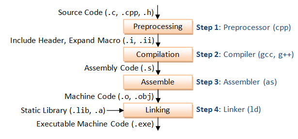
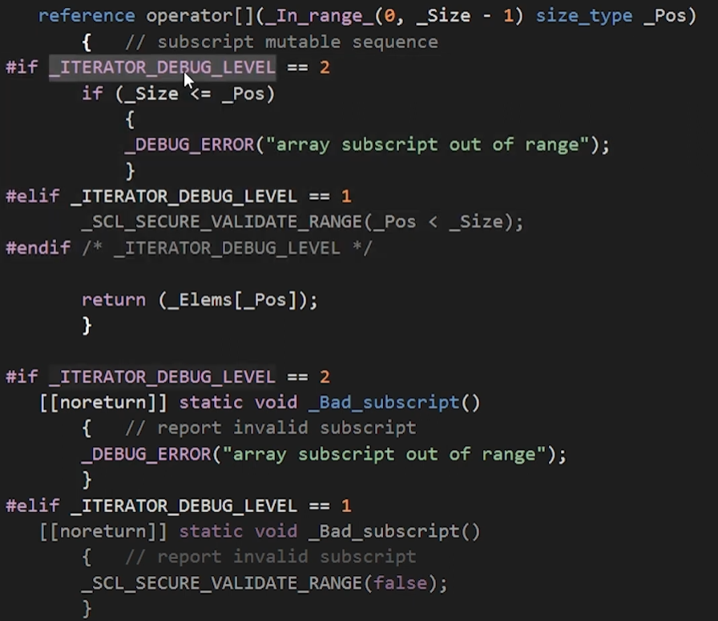

# C++ - by TheCherno

[Course link](https://www.youtube.com/playlist?list=PLlrATfBNZ98dudnM48yfGUldqGD0S4FFb)

## How C++ Works

Statements start with `#` are preprocessor statements.  `#include <iostream>` copy and paste header file `iostream` at the beginning of our source code.

`<<` is an **overload operator** (operator is function).  `std::out << "Hello World!" << std::endl;` is equivalent to `std::out.print("Hello World").print(std::endl);`.  

Compilation: 

More information at [Cornell](static/compilation.pdf).

Notes: read Output page (rather than Error in VS or Problems in VS Code) to fix errors.

For example, we defined a `log()` function in file `log.cpp`. Declaration (e.g. in file `log.h` or just add it before caller) tells the compiler that a function really exists.  Definition (e.g. in file `log.cpp`) tells the compiler how this function behave.  During compilation, linker will find the definition of function `log()` in `log.cpp` and link it to its caller. (If it cannot find the definition, linker error will occur).

## How the C++ Compiler Works

Compiler converts our code into either constant data or instructions.

C++ doesn't care about files.

### Preprocess

Preprocessor statements are usually `#include`, `define`, `if`, and `if def`.  

`#include file` just read the `file` and paste its contents at that position. And `#define A b` just replace A with b.

for example: we have `EndBrace.h`, then we can write `Math.cpp` in the following way.

```cpp
// EndBrace.h
}
```

```cpp
// Math.cpp

# define INTEGER int

INTEGER Multiply (INTEGER a, INTEGER b) {
    INTEGER result = a * b;
    return result;
#include "EndBrace.h"

/* it is equivalent to 
 * 
 * int Multiply(int a, int b) {
 *     int result = a * b;
 *     return result;
 * }
 * 
 */
```

`#if` an `#endif` makes it possible to include or exclude code based on certain condition.

### Compile

Turn preprocessed code into assembly code (`.s` files).

Compiler can optimize your code.

Sometimes, when people talk about compiler, they may mean "compiler + assembler" (`.cpp` -> `.obj`) or "compiler + assembler + linker" (`.cpp` -> `.exe`).

## How the C++ Linker Works

It combines separate object files (`.o` or `.obj`) into a executable file (`.exe`).  Please note that codes in object files and those in executable files are machine-level.

Error code starts with C is compiling error.  Error code starts with LNK is linking error.

> Entry can be assigned to other functions. But people usually don't do it.

To avoid symbol-not-found (symbol means function's name) error while compiling, we need to add declaration of that function before it's called. So that compiler knows that this function really exists. And after compilation, linker will link them together.

### Unresolved-external-symbol error

If we delete the definition of a function, although compiler can compile successfully (because its declaration wasn't deleted, and the compiler trusts us), linker will raise this unresolved-external-symbol error because it cannot find the definition of this function.

Special cases ([6:59](https://youtu.be/H4s55GgAg0I?t=419)) and `static` (8:06).

### Duplicate symbols

> Symbol: function's name.

If functions with same name in

- the same file: we will get a compilation error
- different files: we will get a linking error

Because compiler or linker don't know which function we want to call.

This error is actually pretty common ([11:15](https://youtu.be/H4s55GgAg0I?t=675)).

#### How to solve it?

Watch video [13:00](https://youtu.be/H4s55GgAg0I?t=780).

- `static`: make the duplicate function only visible to its object file (translation unit).
- `inline`: replace the function directly with its definition.
- bring them in the same translation unit—Header files only contain declaration.

## Variables in C++

A variable allows us to name a piece of data and get access to it.

There are a bunch of primitive data types in C++, but C++ don't limit how we use them. So, the only difference between different data types are their size.

The actual size of a primitive data type **depends on compiler**. For example, if you tell `g++` to compile a 32-bit program (`g++ -m32`), then `long` occupies 4 Bytes; if you tell it to compile a 64-bit program (`g++ -m64`), then `long` occupies 8 Bytes. Moreover, although typically, `int` occupies 4 Bytes in both 32- and 64-bit system. The C++ standard only requires it to be at least 2 Bytes (CSAPP 2.2.1), so some compilers may interpret `int` as a 2-Byte number.

When we assign 5.5 to a float `float variable = 5.5`. `5.5` is a double, to assign a float, use `5.5f` or `5.5F`.

bool: 0 is false, anything else is true (including negative numbers).  Although 1 bit is enough to represent a bool, it occupies a Byte (8 bits). Because CPU access addresses in Bytes.  If you want to save spaces, you can store 8 bools in 1 Byte.

function `sizeof()` returns how many Bytes a variable occupies.

pointers: `bool* variable` -> [Pointers in C++](#pointers-in-c)
references: `bool& variable` -> [References in C++](#references-in-c)

## C++ Header Files

Traditionally, header files are used to declare certain **types or functions**.  ONLY declarations!

Because we need declaration to tell the compiler that this function really exists (but in other files). By including header files, we can introduce multiple declarations with one line. (Remember that the preprocessor just copy and paste the file's content when it meets `#include`).  
> subtopic: declaration and signature
> declaration: `int add(int, int);`
> signature: `add(int, int)`  

Header files usually start with `#pragma once` (header guard), which tells the preprocessor to only include this file once in a translation unit.

There is another way to achieve this (header guard)—`#ifndef`.  Although `#pragma once` is more modern because it's cleaner.

```cpp
#ifndef _LOG_H
#define _LOG_H

// Declarations

#endif
```

It's equivalent to:

```cpp
#pragma once

// Declarations
```

### Difference between `#include <>` and `#include ""`

`#include <>` search files in environment paths.  While `#include ""` search files relative to current path (or in environment paths, but it's better to use it only for user-defined files).

C standard libraries ends with `.h`, for example `#include <math.h>`, C++ standard libraries usually have not suffix `#include <iostream>`.

## How to DEBUG C++ in VISUAL STUDIO

- Set break point
- Step over, step into, step out, continue
- Memory viewer ([10:10](https://youtu.be/0ebzPwixrJA?t=610)). A whole bunch of `cc`s means that this variable is not initialized yet.

## BEST Visual Studio Setup for C++ Projects

Video: [![BEST Visual Studio Setup for C++ Projects!][yt
]](https://youtu.be/qeH9Xv_90KM)

## Loops in C++ (for loops, while loops)

Video: [![Loops in C++][yt]](https://youtu.be/_1AwR-un4Hk)

## Control Flow in C++ (continue, break, return)

Video: [![Control Flow][yt]](https://youtu.be/a3IZ8WaIFAA)

## POINTERS in C++

This video is talking about raw pointers but smart pointers.  [Smart pointers](#smart-pointers-in-c-stdunique_ptr-stdshared_ptr-stdweak_ptr) will be talked about in the future.

A pointer is an integer storing an memory address.

Types are meaningless, they just tell the compiler how many bytes to read from write to memory each time. The executable binary program itself knows nothing about types.

If you need a pure pointer and don't want to specify what type it points to, you can use `void*`. For example, we can define a pure pointer as `void* ptr = NULL`, `void* ptr = nullptr`, or `void* ptr = &10` (store 10 in memory and create point to its address).

To define a integer pointer: `int* pi = &8`. If you want to define multiple pointers in one line `int *x, *y, *z;` (mentioned in [![CONST in C++][yt]](https://youtu.be/4fJBrditnJU?t=481)).

`char *buff = new char[8];` allocate 8 bytes in **heap** and let `buff` point to that location on heap.  `memset(ptr, val, size)` (e.g. `memset(buff, 0, 8)`) can initialize (set values for a block of memory).  `delete[] buff` can release the buffer.

Pointers are variables stored in memory. So we can have pointers to pointers. e.g. `char** ptr = &buff`.

Meaning of `*(ptr + num)`: read Section [Arrays in C++](#arrays-in-c).

## REFERENCES in C++

Pointers and references are relevant.

Reference is a reference to an existing variable. They don't occupy new spaces.

For example

```c++
int a = 5;
int* b = &a; // b is a pointer to a
int& c = a; // c is a reference to a 
// Like `int*`, `int&` can also be regarded as a type.
```

A references can be regarded as an alias of that variable. So compilers will combine reference and the original variable to a single variable. Which means that the compiled binary program won't know the existence of references.

Reference is not a real variable, but a syntax sugar to make our life easier.

```c++
// If you want to change the value passed into an function
// You can pass its address
void increment_1(int* value) {
  (*value)++;
}
increment_1(&a);

// But there is a much easier way -- **pass by reference**
void increment_2(int& value) {
  value++;
}
increment_2(a);
```

Please note:

```c++
int a = 5;
int b = 8;

int& ref = a;
ref = b;
// It doesn't mean ref is now representing b.
// Actually, it means that assign a to b's value, 
// which is 8 -> equivalent to `a = 8;`

// But pointers can make it
int* pi = &a;
pi = &b;

// And you cannot create a dangling reference like `int& ref2;`
// You must assign a variable to a reference immediately after
// it's created. 
int& ref2 = b;
```

The return value can also be passed by reference. Read this [StackOverflow](https://stackoverflow.com/questions/2379859/in-c-what-does-mean-after-a-functions-return-type) page.

## CLASSES in C++

For example

```c++
class Player {
  int x, y;
  int speed;
public:
  void SetX(int x) {
    this->x = x;
  }
  void SetY(int y) {
    this->y = y;
  }
  void Move(int xa, int ya) {
    x += xa * speed;
    y += ya * speed;
  }
};  // Don't forget this semicolon

int main() {
  // Create instances of Player
  Player player1;
  Player player2;

  // `player1.x = 5;` is not allowed
  // because members are **private by default**
  player1.SetX(5);
}
```

Please note that classes have NO new functionality and CANNOT do new things. Anything you can do with classes can also be done without classes (that's why C still exists).  But classes can really make our code cleaner and make our life easier.

## CLASSES vs STRUCTS in C++

There is basically no difference between class and struct, except for visibility.

Members and methods of **class** are **private** by default. But in **struct**, they are **public** by default.

Although technically, there are almost no difference between class and struct. People have specific convention / style on choosing class or struct.

Use struct to represent a bunch of variables (e.g. vector in math, node of linked list). So, if I need to define a simple and elementary data type (which may be used in many other places) and I don't want to add too much functionality to it, I'd choose struct. Of course, I can add methods to a struct, but they should only realize basic functions.

And I will use class to represent a complicated structure. And I will add a lot of functionality to it.

Moreover, we should never use inheritance with structs. If we need inheritance, use class.

## How to Write a C++ Class

Let's create a simple Log class as an example. Please note that, in practice, people don't write Log class like this, they are terrible codes.

```c++
class Log {
public:
  const int LogLevelError = 0;
  const int LogLevelWarning = 1;
  const int LogLevelInfo = 2;

private:
  int m_LogLevel = LogLevelInfo; // m_ means it's a private class member variable

public:
  void SetLevel(int level) {
    m_LogLevel = level;
  }

  void Error(const char* message) {
    if (m_LogLevel >= LogLevelError) 
      std::cout << "[ERROR]: " << message << std::endl;
  }

  void Warn(const char* message) {
    if (m_LogLevel >= LogLevelWarning) 
      std::cout << "[WARNING]: " << message << std::endl;
  }

  void Info(const char* message) {
    if (m_LogLevel >= LogLevelInfo) 
      std::cout << "[INFO]: " << message << std::endl;
  }
};

int main() {
  Log log;
  log.SetLevel(log.LogLevelWarning);
  log.Warn("Hello");
  log.Info("Hello"); // This won't be printed
  log.Error("Hello");
}
```

## Static in C++

### Static's meaning in different cases

Read [this](https://www.geeksforgeeks.org/cpp/static-keyword-cpp/).

Local: static inside a function means that symbol (**symbol: function / variable / object's name**) is going to be initialized only once for the entire lifetime of the program.

Local: static inside class or struct means that symbol is going to shared by all instances of the class / struct (for a variable, its memory address is shared; for a method, *it should be called using the class name with the scope resolution operator (::). It can access only static data members or member functions*).

Global: static outside a scope (class, struct, ...) means that the linage of that symbol is going to be internal (only visible to its translation unit, *meaning it is accessible only within the file where it is defined*).

### Global static symbols

This section will focus on the last meaning—static outside a scope. They are accessible only within its translation unit.

For example

```c++
// file1.cpp
static int s_Variable = 5;
```

```c++
// main.cpp
#include <iostream>

int s_Variable = 10;

int main() {
  std::cout << s_Variable << std::endl;
}
```

If we compile and run it, terminal will print `10` successfully.

But if we delete `static` in `file1.cpp` (now: `int s_Variable = 5;`), even if `main.cpp` didn't include `file1.cpp`, there will be linking error—`"int s_Variable (?s_Variable@@3HA) already defined in Main.obj"`.

#### External linkage

To fix this, except for making both of them static, we can also let one refer to the other.

```c++
// file1.cpp
int s_Variable = 5
```

```c++
// main.cpp
// include
extern int s_Variable;  // external linkage
// main function
```

In this case, you cannot make `s_Variable` in `file1.cpp` static (`static int s_Variable = 5;`). Because, if we do so, `main.cpp` cannot see it.

All rules above (about static variables) also holds for static functions.

#### Summary

If you don't need a variable or a function to be global, use static as much as you can.

## Static for Classes and Structs in C++

Static in a class (or struct) means it's shared by all instances of that class. So, you cannot access that variable or function through a **instance**, you should access it with **class name** with the **scope resolution operator (::)**.

And also, in a static method, you cannot refer to a instance, because static methods can be called even without creating any class instance. But you can a static variable or function can be used in a non-static method.

For example: [![static for class or struct][yt]](https://youtu.be/V-BFlMrBtqQt=89)

```c++
struct Entity {
  static int x;
  static int y;

  static void Print() {
    std::cout << x << ", " << y << std::endl;
  }
};

// We have to define static variable before using them
int Entity::x;
int Entity::y;

int main() {
  Entity::x = 5;
  Entity::y = 6;
  Entity::Print();
}
```

## ENUMS in C++

Enum is short for enumeration. It's a way to give a name to a value. It's useful if you want to use integers to represent  certain states and to make your code more readable.

```c++
// If we don't use Enum
int A = 0;
int B = 1;
int C = 2;

int main() {
  int value = B;
  if (value == A) {
    // Do something about A
  } else if (value == B) {
    // Do something about B
  } else if (value == C) {
    // Do something about C
  } else {
    // We cannot limit the allowed values
  }
}
```

With the help of enum, we can limit allowed values.

```c++
// By default, enums are int starting from 0
enum Example {
  A, B, C=100
}; // int A=0; int B=1; int C=100

/* If we set:
  enum Example : unsigned char {
    A=5, B, C
  }
  Then, unsigned char A=5; unsigned char B=6; unsigned char C=7
  we cannot assign enum to float, it must be integer (char, int, long, ...)
 */

int main() {
  Example value = A;
  // This is NOT allowed: `Example value = 0`;
  // You CANNOT assign `int` to `Example`
  // But you can compare them
  if (value == 0) { 
    // Do something about A
  } else if (value == B) { // Unlike Java, we don't write `value == Example.B` (watch enum class)
    // Do something about B
  } else {
    // Do something about C, because only 0, 1, 100 are allowed values
  }
}
```

Let's improve our Log class in section [How to Write a C++ Class](#how-to-write-a-c-class).

```c++
class Log {
public:
  enum Level {
    LevelError = 0, LevelWarning, LevelInfo
  }

private:
  Level m_LogLevel = LevelInfo;

public:
void SetLevel (Level level)
// following things......
};

int main() {
  Log log;
  log.SetLevel(Log::LevelError);  // Note how we access it
}
```

## Constructors in C++

It's a method runs every time we instantiate (create a instance) a object.

```c++
class Entity {
public:
  float X, Y;

  // Constructor
  Entity() {
    X = 0.0f;
    Y = 0.0f;
  }
  Entity(float x, float y) {
    X = x;
    Y = y;
  }
  // Although C++ have default constructor, it does nothing (unlike Java, it helps us initialize int and float to 0)
};

int main() {
  Entity e1; // e1.X = 0, e1.Y = 0
  Entity e2(10.0f, 5.0f); // e2.X = 10, e2.Y = 5
}
```

If we don't want anybody to create any instance for a class (all members and methods are static).  We can either **make the constructor private** or **delete the constructor** (e.g. `Entity() = delete;`)

## Destructors in C++

Destructor runs when you an object.

For heap allocated objects (created with `new`): when you delete it with `delete`, destructors will be called

For stack allocated objects: when the scope ends, destructors will be called.

For example:

```c++
// Example of destructor called when reaches the end of scope
class Entity {
private:
  float X;
  float Y;

public:
  Entity() {
    X = 0.0f;
    Y = 0.0f;
    std::cout << "Created Entity!" << std::endl;
  }

  // Destructor
  ~Entity() {
    std::cout << "Destroyed Entity!" << std::endl;
  }

  Print() {
    std::cout << X << ", " << Y << std::endl;
  }
};

void Function() {
  Entity e; // stack allocated objects
  e.Print();
} // Destructor is executed when Function() returns

int main() {
  Function(); 
}
```

\[Note\]: You can call destructors manually (e.g. `e.~Entity();`). But usually, people don't do so.

## Inheritance in C++

It helps is avoid code duplication.

```c++
class Entity {
public:
  float X, Y;

  Entity() {
    X = 0.0f;
    Y = 0.0f;
  }

  void Move(float xa, float ya) {
    X += xa;
    Y += ya;
  }
};

// You can inherit multiple classes
// class A : public B, public C
class Player : public Entity {
public:
  const char* Name;

  void Print() {
    std::cout << Name << std::endl;
  }
};

int main() {
  Player player;
  player.Move(1, 2);
  std::cout << player.X << std::endl;
}
```

Polymorphism: read [this](https://www.w3schools.com/cpp/cpp_polymorphism.asp).

## Virtual Functions in C++

It allows us to overwrite functions in subclasses.

```c++
class Entity {
public:
  std::string GetName() { return "Entity"; }
};

class Player : public Entity {
private:
  std::string m_Name;
public:
  Player(const std::string &name) : m_Name(name) {}

  // Overrides GetName() 
  // unlike Java, it don't need to write @Override 
  // But it's recommended to add this keyword
  // read section "### Virtual function + override keyword"
  std::string GetName() { return m_Name; }
};

int main() {
  Entity* e = new Entity();
  std::cout << e->GetName() << std::endl; // Entity

  Player* p = new Player("Cherno");
  std::cout << p->GetName() << std::endl; // Cherno

  Entity* entity = p;
  std::cout << entity->GetName() << std::endl; // Entity
}
```

It can be inferred from the last that case that:  
In memory, different objects (instances) are just a block of data (storing its member variables). And the behavior of a function is defined by its type (class), and compilers will read the type and find the definition of methods, than translate them into binary files.

```c++
// define class Entity and class Player

void PrintName(Entity* entity) {
  std::cout << entity->GetName() << std::endl;
}

int main() {
  Entity* e = new Entity();
  PrintName(e); // Entity

  Player* p = new Player("Cherno");
  PrintName(p); // Entity
}
```

Because `PrintName(Entity* entity)` function regard its argument as `Entity`, it will call `Entity`'s version of `GetName()`.

But sometimes, we want to call methods based on its 'real' class.  

### Virtual function

To solve this problem, we can declare the function in base class as **virtual function**.

```c++
class Entity {
public:
  virtual std::string GetName() { return "Entity"; }
};
// following codes
```

It's achieved by creating a v-table for the `Entity` class.

V-table is a table containing all virtual functions within base class (will be introduced later).

### Virtual function + override keyword

Only virtual functions can be overridden. So base class: `virtual std::string GetName() {}`. Subclass: `std::string GetName() override {}`

```c++
class Entity {
public:
  virtual std::string GetName() { return "Entity"; }
};

class Player : public Entity {
private:
  std::string m_Name;
public:
  Player(const std::string &name) : m_Name(name) {}

  // Overrides GetName() with keyword override
  std::string GetName() override { return m_Name; }
};
```

Moreover, it's recommended to add this keyword. Because if we made some mistakes (for example, mis-typed function name or the overridden function is not virtual), the compiler will warn us.

## Interfaces in C++ (Pure Virtual Functions)

Interfaces consist of **pure virtual functions** (in other languages, we say "interfaces", but in C++ we often say "pure virtual functions").  They're classes (acting as templates) with only unimplemented methods, so the **subclasses are required to implement them**.  

Because they don't implement methods, **we cannot create instances of interfaces**. Moreover, if a subclass implement only a part of pure virtual functions, we cannot instantiate that subclass either.

```c++
class Entity {
public:
  // pure virtual function
  virtual std::string GetName() = 0;

  // virtual function
  // virtual std::string GetName() { return "Entity"; }
};
```

Here is another example:

```c++
class Printable {
public:
  virtual std::string GetClassName() = 0;
};

class Entity : public Printable {
public:
  virtual std::string GetName() { return "Entity"; }
  std::string GetClassName() override { return "Entity"; }
};

class Player : public Entity {
private:
  std::string m_Name;
public: 
  Player(const std::string& name) : m_Name(name) {}

  std::string GetName() override { return m_Name; }
  std::string GetClassName() override { return "Player"; }
};

void Print(Printable* obj) {
  std::cout << obj->GetClassName() << std::endl;
}

int main() {
  Entity* e = new Entity();
  Player* p = new Player("Cherno");

  Print(e);
  Print(p);
}
```

## Visibility in C++

It has nothing to do with program performance, it's used to help you organize your code.

Three visibilities: `private`, `protected`, and `public`.  The default visibility for class members is `private`. The default visibility for struct is `public`.

- `private`: "only" the methods of this class can read and write to it.  Actually, methods of `friend` classes can also access it (Will be covered later).
- `protected`: this class and it's child classes can access it.
- `public`: accessible to all.

Mark members as `public` when you this member can be used by others. Otherwise, mark them `private` or `protected`.  It helps both others and yourself.

## Arrays in C++

Arrays store a bunch of data with same type continuously.  With the help of array, we can access multiple variables with only one name.

For example,

```c++
int main() {
  int example[5] = {0,1,2,3,4};

  std::cout << example[0] << std::endl; // 0
  std::cout << example << std::endl; // print the address of array

  example[2] = 5;
  // is equivalent to 
  int* ptr = example.
  *(ptr + 2) = 5;
      // ptr + 2 -> ptr moves 2*sizeof(int) Bytes. 
      // Because ptr's type is int*
  // is equivalent to
  *((char*) ptr + 8) = 5;
      // (char*) says treat ptr as char*. 
      // So ptr moves 8*sizeof(char) = 8 Bytes
  // is equivalent to
  *(int*)((char*) ptr + 8) = 5;

  // initialization
  int example2[5] = {1}; 
      // {1,0,0,0,0} 
      // set the first element to 1 and reset others to 0
  std::fill_n(example2, sizeof(example2)/sizeof(example2[0]), 1); 
      // fill example2 with 1
  // In newer version of C++:
  example2.fill(1); 
  // or 
  std::fill(begin(example2), end(example2), 1)
}
```

We can also create an array with `new` keyword. `int* arr = new int[5]` is equivalent to `int* arr[5]`, except for their lifetime.  

- `int* arr = new int[5]`is created on heap, it will be alive until we destroy it manually with `delete[] arr` (or until the program ends).
- `int* arr[5]` is created on stack, it will be destroyed when we reach the end of the scope (the end curly bracket).

Why create on heap rather than stack?—it's about lifetime, if you have a function creating and returning a new array. You should use `new`. Otherwise, it will be destroyed when the function ends.

\[Note\]: If we create a pointer to an array `int* pa = new int[5]`. When we access the array with the pointer, we need to jump from one memory address to another, which will case cache miss, and slow down the program.  So, to avoid cache miss, create arrays on **stack** whenever possible.

### Arrays in C++11

In C++, "standard array" `std::array<type, num>` is introduced (the arrays above are called "raw array"). Standard arrays have **boundary checking** and keep track of the **length of array**.  

Standard arrays are safer, but raw arrays are faster.

To get the length of a raw array on **stack**, we have to use `sizeof(arr) / sizeof(arr[0])`.  If you apply this method on raw arrays on heap, thing might get wrong. If you write

```c++
int* pa = new int[5]; 
int length = sizeof(pa) / sizeof(int);  
// Wrong! You'll get 1 or 2
```

Because `pa` is a pointer, `sizeof(pa)` will return 8 (on 64-bit program) or 4 (on 32-bit program). So, the length we get will be 8/4 = 2 or 4/4 = 1.

Moreover, you cannot do

```c++
const int size = 5;
int arr[size];
```

In `int arr[size];`, `size` must be known at compile time, but `const int size = 5;` is not known at compile time (because it's C++).  To solve this problem, use `constexpr int size = 5;` or `static const int size = 5;`.  `constexpr` will be covered in other sector.

However, with standard arrays, we can get its length simply.

```c++
sdt::array<int, 5> another_arr;
std::cout << another_arr.size() << std::endl; // 5
```

## How Strings Work in C++ (and how to use them)

String is a sting of text.

### Characters

Characters: in C++ type `char` can represent one Byte of memory. It can also represent one ASCII character.

> Charset (character set) and Character Encoding:
>
> | Charset | Encoding    |
> | :---    | :---        |
> | ASCII   | ASCII       |
> | Unicode | UTF-8/16/32 |
>
> UTF: Unicode Transformation Format
> UTF-16 and UTF-32 are fixed length, they use 16 and 32 bits respectively. UTF-8 is variable length.

8 bits is not enough to represent all letters and symbols in English, Japanese, Korean, Chinese, etc. However, in C++ primitive types, `char` can only represent up to 256 characters (although ASCII only uses non-negative 128 numbers of `char`).

As for how to support non-English characters, it won't be covered here.

### How string works

A string is an **array** of characters.

So, `'A'` is a `char`. `"A"` is a char pointer (string).

### C-style string

Assigning a string: `const char* name = "Cherno";`.  

If you don't want to use it anymore, just don't use it. You should NOT delete it—`delete name;` is illegal.  **Remember: if you didn't use `new` keyword, don't use `delete` keyword.**

`const` make sure that the values stored at those addresses CANNOT be changed. `name[2] = 'a'` is illegal if `name` is declared to be `const char*`.  And it's not recommended to delete `const`. If you define a string to be `char* name = "Cherno";`, then change it `name[2] = 'a'`, it's an **undefined behavior** (watch next [video](https://youtu.be/FeHZHF0f2dw?t=203)).  Thus, strings are immutable, if you want to change a character, just create a new string. So, strings are always `const char*` (some compilers don't let you compile a `char*` without `const`).

All strings are end with a `'\0'` (ASCII 0, NUL) character. It's used to indicate where the string ends. So, `sizeof("Cherno")` is 7 (not 6).

These three are equivalent  
`char* name = "Cherno";`  
`char name2[7] = { 'C', 'h', 'e', 'r', 'n', 'o', '\0' };`  
`char name2[7] = { 'C', 'h', 'e', 'r', 'n', 'o', 0 };`

### C++-style string

C++ standard library has a class called `std::string`. It's essentially a array of `char` (more specifically, `const char*`, same as above).  But there are a bunch of methods related to it.

```c++
#include <string>

int main() {
  std::string name = "Cherno".
  // size() is a method of std::string class
  name.size(); // 6

  // in a char array, we have to use functions (not defined in class)
  char* s1[] = "Cherno";
  char* s2[20];
  strlen(s1); // 6
  strcpy(s2, s1); // copy s1 into s2
}
```

Since you cannot add two pointers together, you cannot add two `const char*` together.  BUT, `+` is overloaded in `std::string` class.

So, `std::string name = "Hello" + ", World!";` is illegal.  But `std::string name = "Hello";  name += ", World!"` and `std::string name = std::string("Hello") + ", World!";` are legal. Or, [use `std::string_literals` library](#stdstring_literals-library).

You can find substrings in a string.

```c++
int main() {
  std::string name = std::string("Hello") + ", World!";
  // name.find("no") returns the address of 'n' in "Cherno"
  if (name.find("no") != std::string::npos) {  // npos: not legal position
    std::cout << "Contains!\n";
  }
}
```

If you want to create a function that **only reads** a string, don't use `PrintString(std::string string)`, use `PrintString(const std::string &string)` (`const` + pass by reference) instead. It can save time and space.

[Document](https://cplusplus.com/reference/string/string/).

## String Literals in C++

### Don't create a string with `\0`

If your string has NUL `'\0'`, you may meet some problem.

```c++
#include <stdlib.h>

int main() {
  const char* name = "Che\0rno";
  std::cout << strlen(name) << std::endl;  // 3, only counts "Che"
}
```

### String Immutability

Changing a character in a string that is not protected by `const` (for example `char* name = "Cherno";`) is undefined behavior.  Because string literals are stored in a read-only segment called "const segment" of memory.  And if you check the generated binary file, you'll find `"Cherno"` is embedded in the binary file. So, they should not be edited.

If you really want to change it, define it as an **array** `char name[] = "Cherno";  name[2] = 'a';`.

### Wide character

We can define a wide character with `const wchar_t* name2 = L"Cherno";`. `L` means the following string is made of wide character (16 bits on windows, 32 bits on Unix/Linux).

There are other types of character.

- `const char* name = u8"Cherno";`—normal string with 8-bit characters. `u8` can be omitted.
- `const wchar_t* name = L"Cherno";`—16 or 32 bits.
- `const char16_t* name = u"Cherno";`—16 bits, used for UTF-16.
- `const char32_t* name = U"Cherno";`—32 bits, used for UTF-32.

### `std::string_literals` library

From C++14, you can use `std::string_literals` to concatenate strings. For example, `std::string name = "Cherno"s + " hello.";`. The `s` convert `"Cherno"` into a `std::string`. You can also do `std::string name = u8"Cherno"s;`, `std::wstring name = L"Cherno"s;`, `std::u16string name = u"Cherno"s;`, `std::u32string name = U"Cherno"s;` to specify how many bytes are used for one character.

### Multiline string

```c++
const char* example = R"(Line1
Line2
Line3)"; // don't forget ()
// is equivalent to
const char* example2 = "Line1\n"
"Line2\n"
"Line3"
```

### String literals are always on read-only segment

String literals are always on read-only segment. Even if we created an array of characters and change it.

```c++
char name[] = "Cherno";
name[2] = 'a';
```

`name` will point to a location not in read-only segment. Then it reads the string ("Cherno") from read-only segment and copy it into where `name` is pointing at, then modifies it.  If we don't modify it, `name` will point to the read-only segment directly.

[![string literals][yt]](https://youtu.be/FeHZHF0f2dw?t=683)

## CONST in C++

`const` don't change the generated program. It only makes our code cleaner and enforces certain rules.  It's a promise that you won't change it.  But of course, you can bypass it and break your promise (but if you really want to change it, just don't declare it a `const`).

You can change a `const` by creating a pointer pointing to it and change the content of that pointer.  But try to **avoid** doing so.

```c++
int main() {
  const int MAX_AGE = 90;
  int* a = new int;
  a = (int*)(&MAX_AGE);
  *a = 2;
  std::cout << *a << std::endl; // 2
}
```

`const int` and `int const` are equivalent.

### Constant pointers

#### `const` before `*`

`const int* a` and `int const* a` mean you cannot change the contents of that pointer. But you can change the address it pointing to.  ->  `a` is a pointer pointing to a `const int`, you can regard them as `(const int)* a` and `(int const)* a`.

```c++
const int MAX_AGE = 90;
const int* a = new int; 
    // or int const* a = new int; 
// *a = 2;                // illegal
a = (int*)(&MAX_AGE);     // legal
```

#### `const` after `*`

While `int* const a` means that you cannot change where `a` is pointing to. But you can change its contents.  ->  `a` is a `const` pointer pointing to a fixed address. You can regard it as `(int*) (const a)`

```c++
const int MAX_AGE = 90;
int* const a = new int;
*a = 2;                   // legal
// a = (int*)(&MAX_AGE);  // illegal
```

#### Two `const` pointer

`const int* const a`: you cannot change the contents or where it points to.

### Constant methods in classes

In classes, if you write `const` on the right of a method means **this method cannot modify any class members**.

```c++
class Entity {
private:
  int m_X, m_Y;
public:
  int GetX() const { // it's a good idea to declare getters to be `const`
    // m_X = 2; is illegal
    return m_X;
  }

  void SetX(int x) { // you should not declare setters to be `const`
    m_X = x;
  }
};
```

If `m_X` is a pointer, you can even write 3 `const`s in one line.  `int* m_X;` `const int* const GetX() const { return m_X; }`.  It means that this method will return a pointer that whose contents cannot be modified, and itself cannot be modified, too. Moreover, this method cannot modify the class members.

#### Why uses `const` in classes

[![Why uses const in class][yt]](https://youtu.be/4fJBrditnJU?t=512)

```c++
class Entity {
private:
  int m_X;
public:
  int GetX() const {
    return m_X;
  }
};

void PrintEntity(const Entity& e) {
  std::cout << e.GetX() << std::endl;
}
```

If I want to create a read-only function outside the class.

- I want to pass by reference, because it saves memory. -> `&e` (or pass the pointer `*e`)
- I don't want to modify the entity, because it's a read-only function. -> `const Entity& e` (or `const Entity* e`)
- Because `e` is declared to be `const`, `e.GetX()` can be called only if `GetX()` is declared to be `const` (otherwise, compiler don't know whether `GetX()` will modify `e` or not). -> `int GetX() const`

So, if an instance is declared to be `const` in a function, only the `const` methods of that class can be called.  ->  Always mark your methods as `const` as long as it don't modify class members.

#### Mutable

[![mutable][yt]](https://youtu.be/4fJBrditnJU?t=683)

If you want to mark the method `const` but you really need to modify some variable that don't affect the program much (maybe for debugging), declare that variable `mutable`.

```c++
class Entity {
private:
  int m_X = 0;
public:
  mutable int count = 0;

public:
  int GetX() const {
    count++;
    return m_X;
  }
};

void PrintEntity(const Entity& e) {
  std::cout << e.GetX() << std::endl;
}

int main() {
  Entity e;
  PrintEntity(e);
  PrintEntity(e);
  std::cout << e.count << std::endl;  // 2
}
```

## The Mutable Keyword in C++

Mutable means something can change. When we talk about `mutable` in C++, we usually mean something is kind of `const` but **can** change.

### Mutable with const methods

```c++
class Entity {
private:
  std::string m_Name;
  mutable int m_DebugCount = 0; // mutable: allow const method modify it
public:
  const std::string& GetName() const {
    m_DebugCount++; // If you have to change a method in a const method, mark it as mutable
    return m_Name;
  }
};

int main() {
  const Entity e;
  e.GetName(); // Because e is a const Entity, GetName() can be called only if it's a const method
}
```

### Mutable in lambda expression

Lambda is a little throwaway function let you assign a variable quickly.

```c++
int main() {
  // Here is a lambda expression
  int x = 1, y = 5;
  // Definition
  auto f = [&x, y]() { // pass x by reference, pass y by value
    x++;
    std::cout << x << std::endl;
    std::cout << x << std::endl;
  };

  // Call
  // don't write f(x, y). lambda will find x and y outside its scope automatically
  f();
}
```

Parameters can be passed in these ways:

- `f = [x](){expression}`: pass `x` by value
- `f = [&x](){expression}`: pass `x` by reference
- `f = [=](){expression}`: pass everything it receives by value
- `f = [&](){expression}`: pass everything it receives by reference

However, if you want to pass `x` by value (because you don't want to change its value outside lambda), you cannot use `x++` in lambda expression.

```c++
// The following expression is Illegal
auto f = [x]() {
  x++; 
  std::cout << x << std::endl;
}
```

You can solve it by assigning a new variable `y` equal to `x`, then change `y`.

```c++
auto f = [x]() {
  int y = x;
  y++
  std::cout << y << std::endl;
};
```

However, this method creates a new copy. We have already copied `x`'s value by passing by value.  If we use `mutable` keyword, we can solve this problem without creating more variables.

```c++
auto f = [x]() mutable {
  x++
  std::cout << y << std::endl;
};
```

## Member Initializer Lists in C++ (Constructor Initializer List)

There are two ways to initialize class (or struct) members. The first way is by using **constructors**.

```c++
class Entity {
private:
  std::string m_Name;

public:
  Entity() {
    m_Name = "Unknown";
  }
  Entity(const std::string& name) {
    m_Name = name;
  }
  void Print() {
    std::cout << m_Name << std::endl;
  }
};

int main() {
  Entity e0;
  e0.Print(); // Unknown
  Entity e1("Cherno");
  e1.Print(); // Cherno
}
```

The second way is through **member initializer list**.

```c++
class Entity {
private:
  std::string m_Name;
  int m_Score;

public:
  Entity() 
    : m_Name("Unknown"), m_Score(0) {}
  Entity(const std::string& name, int score) 
    : m_Name(name), m_Score(score) {}
  void Print() {
    std::cout << m_Name << ": " << m_Score << std::endl;
  }
};

int main() {
  Entity e0;
  e0.Print(); // Unknown: 0
  Entity e1("Cherno", 100);
  e1.Print(); // Cherno: 100
}
```

**\[Note\]**: When you are using member initializer list, the order of initialization is based on the order of how you define them.  For example, even if you write constructor in this way `Entity() : m_Score(0), m_Name("Unknown") {}`, `m_Name` will be initialized first. Because it's defined before `m_Score`.  So, to not make yourself confused, **write initializer list in the same order as definition.**

The second way is more recommended. First, it separate initialization and other things constructor should do, so than you can focus more on "other things".

Moreover, the second way is faster. Because in the first way, **member variables (except for primitive types) are constructed twice**—first time with default constructor, allocating space for them; second time giving values to them and discard the previous value.

```c++
class Example {
public:
  Example() {
    std::cout << "Created Entity" << std::endl;
  }
  Example(int x) {
    std::cout << "Created Entity with " << x << std::endl;
  }
};

class Entity {
private:
  std::string m_Name;
  Example m_Example;

public:
  Entity() { // generate m_Name and m_Example with default constructor
    m_Name = std::string("Unknown"); // omg, m_Name is given a new value, discard the original one
    m_Example = Example(8); // omg, m_Example is given a new value, discard the original one
  }
};

int main() {
  Entity e0; 
    // Created Entity
    // Created Entity with 8
}
```

`m_Example` is constructed twice. If you changed the constructor to `Entity() : m_Name("Unknown"), m_Example(8) {}`, only "Created Entity with 8" will be printed.

## Ternary Operators in C++ (Conditional Assignment)

This section is pretty simple: `<condition> ? <if true> : <if false>`. Please note that in Python, this expression is in different order `<if true> if <condition> else <if false>`.

> Ternary: of, relating to, or proceeding by threes

You can also nest ternary operators: `rank = level > 5 ? level > 10 ? "Master" : "Intermediate" : "Beginner"`. It can be regarded as `rank = level > 5 ? (level > 10 ? "Master" : "Intermediate") : "Beginner"`. But try **not** to do so.  If you have to write in this way, use the following format.

```c++
// copied from @jonsnow8543's comment
rank = level > 10 ?       "Master" :
       level >  5 ? "Intermediate" :
                        "Beginner" ;
```

## How to CREATE/INSTANTIATE OBJECTS in C++

There are two choices of instantiate (creating instances of) classes.  Creating on **stack** or on **heap**.  Note: Even empty class—class without any member—occupies at least one byte.

**Stack** objects' lifespan are controlled by their scope. Once the program goes out of the scope, the objects declared in the scope are destroyed automatically.

**Heap** objects will live forever until the program exits or you destroy them manually.

```c++
using String = std::string;

class Entity {
private:
  String m_Name;
public:
  Entity() : m_Name("Unknown") {}
  Entity(const String& name) : m_Name(name) {}

  const String& GetName() const { return m_Name; }  // it's a const method returning const String& 
};
```

Here is a trick: `using String = std::string;` helps you type less.

Notice that the return type of `GetName()` is `String&` (`std::string&`), it returns a **reference**, meaning that the returning variable and the variable in this function share the same **address**. Read this [StackOverflow](https://stackoverflow.com/questions/2379859/in-c-what-does-mean-after-a-functions-return-type) page for more information.

And we can instantiate the class in following ways.

### On stack

```c++
int main() {
  // --- Create on stack ---
  Entity e0; // or Entity e0{};
  Entity e1("Cherno"); // or Entity e0{"Cherno"};
  Entity e2 = Entity("Cherno"); // or Entity e2 = Entity{"Cherno"};
}
```

#### When create object on stack

Almost all the time, because it is faster, and we don't need to destroy objects manually.  **If you can instantiate on stack, DO instantiate on stack.**

Remember: creating objects on stack are **faster**, and we **don't need to manage them manually**.

#### When don't instantiate on stack

- When you want the object live outside the scope (you want to manage the lifetime of the object manually). [![when to create objects on heap][yt]](https://youtu.be/Ks97R1knQDY?t=296)

  ```c++
  // If we create on stack
  int main() {
    Entity* pe;
    {
      Entity e("Cherno");
      pe = &e;
    }

    // Other codes

    std::cout << pe->GetName() << std::endl; // Illegal!!!
  }
  ```

  The location where `pe` is pointing at is destroyed when the program gets out of the scope. If that location is used, `pe->GetName()` will return the contaminated data.

  Instead, we can create the object on **heap**.

  ```c++
  // If we create on heap
  int main() {
    Entity* pe;
    {
      pe = new Entity("Cherno"); // on heap
    }

    // Other codes

    std::cout << pe->GetName() << std::endl; // Legal!!!
    delete pe; // destroy the object
  }
  ```

- When the stack don't have enough space

  Stacks are usually small (usually several megabytes, depending on your platform and compiler). If we have too many large objects, there will be no enough room on stack to allocate them.

## The NEW Keyword in C++

[![the new keyword in c++][yt]](https://youtu.be/NUZdUSqsCs4)

The keyword `new` allocates memory on the **heap**, and return its **address**.  It's slower than on stack, because it needs to do many steps (for example, find a location with enough space).

Usually (if we don't overload `new`), calling `new` will call `malloc()`.  Although both `new` and `malloc()`  can be used to instantiate objects.  Notice that `new` will call constructors for you, but `malloc()` won't.  Moreover, when no enough space is available, `malloc()` it will return `nullptr`, while `new` will throw a `std::bad_alloc` exception. Read this [StackOverflow](https://stackoverflow.com/questions/3389420/will-new-operator-return-null) page for more information.

\[REMEMBER\]: If you use `new`, you have to use `delete`. Otherwise, more and more spaces are occupied in heap and **memory leak** will occur.

### Deleting a array is different

```c++
int* arr = new int[50];
delete[] arr;  // delete array
```

### Placement `new`

If you want to specify where to allocate the object:

```c++
void* p = malloc(sizeof(Entity));
if (p == nullptr) {
  throw std::bad_alloc();
}
Entity* e = new(p) Entity(); // create Entity at p
```

## Implicit Conversion and the Explicit Keyword in C++

[![type conversion][yt]](https://youtu.be/Rr1NX1lH3oE)

### Implicit conversion

```c++
class Entity {
private:
  std::string m_Name;
  int m_Age;
public:
  Entity(const std::string& name) 
    : m_Name(name), m_Age(-1) {}
  Entity(const int age) 
    : m_Name("Unknown"), m_Age(age) {}
};

void PrintEntity(const Entity& entity) {
  // Printing codes...
}

int main() {
  // Normal case
  Entity a = Entity("Cherno");
  Entity b = Entity(22);
  
  // Implicit conversion
  Entity c = 22;
  PrintEntity(22); // PrintEntity(Entity(22))
  Entity d = std::string("Cherno");
  PrintEntity(std::string("Cherno")); // PrintEntity(Entity("Cherno"))
}
```

You cannot write `Entity c = "Cherno"` or `PrintEntity("Cherno");`, because `"Cherno"` is `const char[]` by default. So it has to go through 2 conversions (`const char[]` to `std::string` to `Entity`) in those codes. However, C++ will only do one implicit conversion for us.

### Explicit keyword

The keyword `explicit` disables implicit conversion.

```c++
class Entity {
private:
  std::string m_Name;
  int m_Age;
public:
  explicit Entity(const int age) 
    : m_Name("Unknown"), m_Age(age) {}
};

int main() {
  // Legal
  Entity a(22); // Constructor
  Entity b = Entity(22); // Constructor
  Entity c = (Entity)22; // explicit conversion

  // Illegal!
  Entity d = 22; // implicit conversion -> illegal
}
```

`explicit` can help you write safe codes, because it prevent unintentional casting. But it's not used so often.

## OPERATORS and OPERATOR OVERLOADING in C++

[![operators in c++][yt]](https://youtu.be/mS9755gF66w)  
[Operator references](https://en.cppreference.com/cpp/language/operators)

Operators are just functions.  Use operator overloading only in cases make perfect sense.

Here is an example of operator overloading. Some special operators will be covered in other videos.

```c++
struct Vector2 { // two-component vector
  float x, y;
  Vector2(float x, float y)
    : x(x), y(y) {}
  void Print() {
    std::cout << "x: " << x << "  y: " << y << std::endl;
  }

  Vector2 operator+(const Vector2& other) const {
    return Vector2(x + other.x, y + other.y);
  }
  Vector2 operator*(const Vector2& other) const {
    return Vector2(x * other.x, y * other.y);
  }

  Vector2 Add(const Vector2& other) const {
    return operator+(other);
  }
  Vector2 Multiply(const Vector2& other) const {
    return operator*(other);
  }
};

int main() {
  Vector2 position(4.0f, 4.0f);
  Vector2 speed(0.5f, 1.5f);
  Vector2 powerup(1.1f, 1.1f);

  Vector2 result = position + speed * powerup;
  result.Print(); // x: 4.55  y: 5.65
  
  // or
  Vector2 result2 = position.Add(speed.Multiply(powerup));
  result2.Print(); // x: 4.55  y: 5.65
}
```

### Operator `<<` in `std::cout`

`std::cout` overloaded `<<` operator. So that we can use `std::cout << aString`.

If we want to print a user-defined class on the console. We can overload `<<`.

```c++
// Definition of Vector2
std::ostream& operator<<(std::ostream& stream, const Vector2& other) {
  stream << other.x << ", " << other.y;
  return stream;
}

int main() {
  Vector2 position(4.0f, 4.0f);
  std::cout << position << std::endl; // 4, 4
}
```

### Overloading operator `==` and `!=`

```c++
struct Vector2 { // two-component vector
  float x, y;
  Vector2(float x, float y)
    : x(x), y(y) {}

  bool operator==(const Vector2& other) const {
    return x == other.x && y == other.y;
  }
  bool operator!=(const Vector2& other) const {
    return !(*this == other);
  }
};

int main() {
  Vector2 vec0(1.0f, 2.0f);
  Vector2 vec1(3.0f, 2.0f);
  Vector2 vec2(1.0f, 2.0f);
  std::cout << (vec0 == vec1) << std::endl; // 0
  std::cout << (vec0 == vec2) << std::endl; // 1
  std::cout << (vec0 != vec2) << std::endl; // 0
}
```

Although overloading operators are convenient, they make your code looks wired sometimes, so think carefully before using this technique.

## The "this" keyword in C++

The keyword `this` means a **pointer** pointing the current object.

```c++
void PrintEntity(const Entity& e)

class Entity {
public:
  int x, y;
  Entity(int x, int y) {
    this->x = x;
    this->y = y;

    // "this" also helps you call a outside function
    PrintEntity(*this);
  }
};

void PrintEntity(const Entity& e) {
  // Print Entity
}
```

You can also write `delete this;` in a class. But it's **not** recommended to do so.

## Object Lifetime in C++ (Stack/Scope Lifetimes)

[![object lifetime][yt]](https://youtu.be/iNuTwvD6ciI)

```c++
class Entity {
public:
  Entity() {
    std::cout << "Created Entity!" << std::endl;
  }
  ~Entity() {
    std::cout << "Destroyed Entity!" << std::endl;
  }
};

int main() {
  {
    Entity e; // Created Entity! (on **stack**)
  } // Destroyed Entity!
  std::cout << "Exited Scope!" << std::endl; // Exited Scope!
  
  {
    Entity* e = new Entity(); // Created Entity! (on **heap**)
  }
  std::cout << "Exited Scope!" << std::endl; // Exited Scope!
}
```

Objects on heap won't be destroyed when getting outside the scope.

Because objects on stack will be destroyed when exiting the scope, don't write code like this:

```c++
int* CreateArray() {
  int array[50];
  return array;  // return an address (pointer)
  // WRONG!!!
  // array will be destroyed when exiting this function
}
```

To solve this problem, you can either allocate it on heap `int* array = new int[50];`. Or create an object outside the function and fill the data in it.

```c++
void CreateArray(int* array) {
  // fill the array
  return;
}

int main() {
  int array[50];
  CreateArray(array)
}
```

### Automatically delete a heap object

Use smart pointer (will be covered in the [lecture](#smart-pointers-in-c-stdunique_ptr-stdshared_ptr-stdweak_ptr)). But we'll define a scoped pointer for ourself in this section.

```c++
class Entity {
public:
  Entity() {
    std::cout << "Created Entity!" << std::endl;
  }
  ~Entity() {
    std::cout << "Destroyed Entity!" << std::endl;
  }
};

class ScopedPtr {
private:
  Entity* m_Ptr;
public:
  ScopedPtr(Entity* ptr)
    : m_Ptr(ptr) {}
  ~ScopedPtr() {
    delete m_Ptr;
  }
};

int main() {
  {
    ScopedPtr e(new Entity());
  }
  std::cout << "Exited Scope!" << std::endl;
  // Created Entity!
  // Destroyed Entity!
  // Exited Scope!
}
```

Even though the instance of Entity is created on heap, it's destroyed when getting outside the scope.

With this feature, we can write a timer class to measure how fast your function runs—create a timer object at the beginning of your function, and it will be destroyed when the function ends. Both constructor and destructor record current time, and you can get how long a function runs with this class.

Moreover, you can write automatically destroyed lock to make sure only one thread can access a function.

## SMART POINTERS in C++ (std::unique_ptr, std::shared_ptr, std::weak_ptr)

Smart is essentially a wrapper around a real pointer. When you create a smart pointer, it will call `new` and allocate memory on heap for you. And at some point (based which smart pointer you use), that memory will be freed automatically.

### Auto pointers

Deprecated.

### Unique pointers

A unique pointer is a scoped pointer. When it gets out of the scope, the pointer will be destroyed and the memory allocated for it will be freed.

They are called "unique" pointer because they have to be unique. They cannot be copied, making sure **that memory can be pointed by only one pointer**.  So, when that unique pointer is deleted, that memory can be freed safely.

```c++
class Entity {
public:
  Entity() {
    std::cout << "Created Entity!" << std::endl;
  }
  ~Entity() {
    std::cout << "Destroyed Entity!" << std::endl;
  }
};

int main() {
  {
    // You can create unique pointer in this way:
    // std::unique_ptr<Entity> entity(new Entity());
    // But the preferred way of creating unique pointer is:
    std::unique_ptr<Entity> entity = std::make_unique<Entity>(); // output: Created Entity!

    // std::unique_ptr<Entity> e = entity;  // Illegal, unique pointers cannot be copied
  } // output: Destroyed Entity!

  std::cout << "Exited Scope!" << std::endl; // Exited Scope!
}
```

Why `std::unique_ptr<Entity> entity = std::make_unique<Entity>();` is preferred to `std::unique_ptr<Entity> entity(new Entity());`?  Because of *exception safety*—If the object is created successfully, but it failed to create the unique pointer (maybe because insufficient space), the object cannot be deleted anymore and causing memory leak.

`std::unique_ptr<Entity> entity(new Entity());` means you create a Entity on heap and pass its address to the constructor of `std::unique_ptr` to create a unique pointer.

You **cannot** write `std::unique_ptr<Entity> entity = new Entity();` (there's no implicit conversion for the constructor of `std::unique_ptr`), it means you created a unique pointer, and re-assign the address it is pointing to. That's **illegal**.

### Shared pointers

If you want to copy or pass the pointer (by value) to a function. Use shared pointer `std::shared_ptr`.

How shared pointer is implemented depends on the compiler and the standard library you are using with your compiler. But almost all systems use *reference counting*—you count how many references are there to the shared pointer, when the count reaches 0, delete the pointer and free the space.

```c++
class Entity {
  // same as above
};

int main() {
  std::shared_ptr<Entity> e;
  {
    // Same as unique pointer, you can also create a shared pointer in the following way (not recommended)
    // std::shared_ptr<Entity> sharedEntity(new Entity());

    std::shared_ptr<Entity> sharedEntity = std::make_shared<Entity>(); // output: Created Entity!
    e = sharedEntity; // You can copy a shared pointer
  }

  std::cout << "Exited Scope!" << std::endl; // output: Exited Scope!
} // output: Destroyed Entity!
```

Objects are destroyed only when all references to that shared pointer are deleted.

`std::shared_ptr<Entity> sharedEntity = std::make_shared<Entity>();` is preferred to `std::shared_ptr<Entity> sharedEntity(new Entity());` not only because of exception safety. But also because shared pointers needs another block of memory called *control block* storing reference count, if we create a object and pass its address to the shared pointer's constructor, there will be two memory allocation (object and control block), which is slower.

### Weak pointers

When you assign a shared pointer to a weak pointer, **it won't increase the reference count**. And when it is destroyed, the **reference count won't decrease**, too.

```c++
class Entity {
  // same as above
};

int main() {
  std::weak_ptr<Entity> e;
  {
    std::shared_ptr<Entity> sharedEntity = std::make_shared<Entity>(); // output: Created Entity!
    e = sharedEntity;
  } // output: Destroyed Entity!

  std::cout << "Exited Scope!" << std::endl; // output: Exited Scope!
}
```

You can ask if a weak pointer expired.

### When to use smart pointers

All the time. Unless you want to manage the memory by yourself.

Unique pointers vs shared pointers: use **unique pointer** as whenever you can.

### More information

Read [this](https://www.geeksforgeeks.org/cpp/smart-pointers-cpp/) page.

## Copying and Copy Constructors in C++

Sometimes, we want to copy an object because we want to modify it without changing the original copy. But sometimes, we don't want to avoid copying because it's time consuming.  So, it is important to understand when C++ will or will not copy for us. And we need to know how to make copying happen as well as how to avoid copying.

Example: [![example of copy][yt]](https://youtu.be/BvR1Pgzzr38?t=63)

Unlike Python, in C++ when you use assignment (`=`), what the compiler does is **always copying**.  If you don't want to copy the object, then create the object on heap and copy its address.

> Note: in Python, primitive types (int, float, ...) are copied, but non-primitive types (list, dictionary, ...) are referenced.

```c++
// A old-school way to write a string class
class String {
private:
  char* m_Buffer;
  unsigned int m_Size;
public:
  String(const char* string) {
    m_Size = strlen(string);
    m_Buffer = new char[m_Size + 1]; // we need one byte for NUL
    memcpy(m_Buffer, string, m_Size); // If we use strcpy, a NUL will also be copied -> strcpy(m_Buffer, string);
    m_Buffer[m_Size] = 0; // NUL: '\0'
  }

  ~String() {
    delete[] m_Buffer;
  }

  char& operator[](unsigned int index) {
    return m_Buffer[index];
  }

  friend std::ostream& operator<<(std::ostream& stream, const String& string);
};

// Definition of Vector2
std::ostream& operator<<(std::ostream& stream, const String& string) {
  stream << string.m_Buffer;
  return stream;
}

int main() {
  String string = "Cherno";
  std::cout << string << std::endl;
}
```

If we use `String second = string;`, there will be a problem about memory leak. Because `String second = string;` is a ***shallow copying***, it copies only `m_Size` and `m_Buffer` (pointer), but don't copy the string. So, when it reaches the outside of scope, the destructors of both `string` and `second` will delete the object at the same address, causing the program crash.  Moreover, if we modify `second`, `string` will be modified, too. Because their `m_Buffer`s are pointing at the same address! [![memory leak][yt]](https://youtu.be/BvR1Pgzzr38?t=527)

To solve this problem, we need ***deep copying***. To make it happen, we don't write our own clone function. We can use ***copy constructor***.  A copy constructor is the constructor called when you assign a object from the same class to it. It's a constructor whose argument is another object in the **same class**.

Even if we don't write any copy constructor, there will be a default one. It will look like:

```c++
// The **default** copy destructor
class String {
private:
  char* m_Buffer;
  unsigned int m_Size;
public:
  // Constructor
  String(const String& other)
    : m_Buffer(other.m_Buffer), m_Size(other.m_Size) {}
  // Destructor and operator overloading
};
```

More exactly, the default copy constructor is `String(const String& other) { memcpy(this, &other, sizeof(String)); }`.

If we want to implement deep copying:

```c++
// Deep copying
class String {
private:
  char* m_Buffer;
  unsigned int m_Size;
public:
  // Constructor
  String(const String& other)
    : m_Size(other.m_Size) {
    m_Buffer = new char[m_Size + 1];
    memcpy(m_Buffer, other.m_Buffer, m_Size + 1);
  }
  // Destructor and operator overloading
};

int main() {
  String string = "Cherno";
  String second = string;
  second[2] = 'a';
  std::cout << string << std::endl; // Cherno
  std::cout << second << std::endl; // Charno
}
```

However, if we want to pass those strings to a function, they're passed by copying (value), meaning every time it is passed to a function, C++ will **create a whole new String object** and pass to the function.  To solve this, we just need to pass by reference `void PrintString(const String& string)` [![print the string][yt]](https://youtu.be/BvR1Pgzzr38?t=973)

Takeaway: **ALWAYS PASS YOUR OBJECT BY (CONST) REFERENCE**. If you want to change the original object, pass by reference. If you want to modify it only inside the function, create a copy **inside** the function and modify the copy.

## The Arrow Operator in C++

If we have a pointer to a object, then `(*ptr).member` can be simplified to `ptr->member`.

That's all.

But if you want, you can overload it.

### Overload an arrow operator

```c++
class Entity {
private:
  int x;
public:
  void Print() const { std::cout << "Hello" << std::endl; }
};

class ScopedPtr {
private:
  Entity* m_Obj;
public:
  ScopedPtr(Entity* entity) 
    : m_Obj(entity) {}
  ~ScopedPtr() { delete m_Obj; }
};

int main() {
  ScopedPtr entity = new Entity();
  entity->Print(); // Illegal
}
```

Calling `entity->Print();` is illegal, because ScopedPtr don't have member `Print()`. And `entity` is not a pointer, it is a class with a pointer as its member variable

In this case, we need to overload `->`.

```c++
class ScopedPtr {
private:
  Entity* m_Obj;
public:
  ScopedPtr(Entity* entity) 
    : m_Obj(entity) {}
  ~ScopedPtr() { delete m_Obj; }

  Entity* operator->() { return m_Obj; }
  const Entity* operator->() const { return m_Obj; }
}
```

### Other usage of arrow operator

We can get the offset of a variable by arrow operator;

```c++
struct Vector3 {
  float x, y, z;
};

int main() {
  int offsetX = (int)&((Vector3*)0)->x; // 0
  int offsetY = (int)&((Vector3*)0)->y; // 4
  int offsetZ = (int)&((Vector3*)0)->z; // 8
}
```

Meaning of `(int)&((Vector3*)0)->y`:

- `(Vector3*)0`: Cast address `0x0` to pointer `Vector3*`. We can assume it creates an object (lets's call it `vec`) at location `0x0`, although it doesn't.
- `vec->y`: Get `vec`'s member variable `y`, which is located at `0x4`.
- `&vec->y`: Get `y`'s address—`0x4`.
- `(int)&vec->y`: Cast the address (`float*`) to `int`, which is `4`.

## Dynamic Arrays in C++ (std::vector)

It's very important to get to know some standard libraries in C++.

***Standard template library (STL)*** is essentially a library filled with **containers**.  The word "template" means the elements' data types is decided by us. You can provide the type that this container can handle. For example, `std::vector<T>`, where `T` is a template, it can be `int` or `float` or a user-defined class.

### std::vector

It's a long story why it's called "vector". So, let's skip it.  To understand it better, you can think of it an "array list".  It's essentially a **dynamic array**.

Unlike `std::array`, **`std::vector` can resize**. The implementation is basically, when the space is not enough, it will **create a bigger array and copy everything to it**. Then destroy the original one.

Usually, the allocation mentioned above occurs quite often, so STL isn't super fast. Thus, a lot of companies will create their own container libraries.

```c++
struct Vertex {
  float x, y, z;
};

std::ostream& operator<<(std::ostream& stream, const Vertex& vertex) {
  stream << vertex.x << ", " << vertex.y << ", " << vertex.z;
  return stream;
}

int main() {
  std::vector<Vertex> vertices;
  vertices.push_back({1,2,3});
  vertices.push_back({4,5,6});
  for (const Vertex& v : vertices)
    std::cout << v << std::endl;

  vertices.erase()
  vertices.clear(); // clear the container
}
```

FAQ: should I store pointers to heap allocated objects in my vector? Or should I store the objects themselves? -> It depends. It's generally more optimal to store objects rather than pointers. So it's very optimal if you iterate over them. The only problem with storing objects is when it needs to resize, it have to copy many things. [![heap pointer vs stack object][yt]](https://youtu.be/PocJ5jXv8No?t=433)

`for (Vertex v : vertices)` vs `for (const Vertex& v : vertices)`: The first case copies every Vertex in side the scope. However, the second uses reference, making it faster.

### How to read this complicated argument list

.png)
[![vector.erase() argument list][yt]](https://youtu.be/PocJ5jXv8No?t=690)

This function takes an ***iterator***. Iterators are some special pointers. If I want to get the iterator pointing to the second element (index is 1): `vertices.begin() + 1`.

### Tips for Dynamic Array

Pass the STL **by (const) reference** into functions.

Be careful:

- `std::vector<int>(10, 20)` -> create a vector with 10 elements, all elements are 20. **`()` calls constructor.**
- `std::vector<int>{10, 20}` -> create a vector with 2 elements, which are 10 and 20 respectively. **`{}` matches `initializer_list` first, if couldn't match any, calls constructor.**

So, remember that: for all classes, if you want to pass data, use `{}`, if you want to pass arguments, use `()`. If you want to initialize a empty object use `std::vector<int> v` or `std::vector<int> v{}`.

## Optimizing the usage of std::vector in C++

This lecture is talking about how to use `std::vector` in a more optimal way. As for optimizing in a more lower-level way, it won't be covered here.

How vector works: As mentioned above, it creates an array and maintain a member variable size to record how many elements are valid, as you pushing back elements, when there is no space any more (when size is about to exceed capacity), it will allocate new memory to store those data. And transfer old data to the new addresses.

Our optimize strategy: avoid copying.

### When and how copying happens

```c++
struct Vertex {
  float x, y, z;

  Vertex(float x, float y, float z)
    : x(x), y(y), z(z) {}
  Vertex(const Vertex& vertex)
    : x(vertex.x), y(vertex.y), z(vertex.z) {
      std::cout << "Copied!" << std::endl;
    }
};

std::ostream& operator<<(std::ostream& stream, const Vertex& vertex) {
  stream << vertex.x << ", " << vertex.y << ", " << vertex.z;
  return stream;
}

int main() {
  std::vector<Vertex> vertices;
  vertices.push_back(Vertex{1,2,3});
  vertices.push_back(Vertex{4,5,6});
  vertices.push_back(Vertex{7,8,9});
} // output: Copied! * 6
```

Although we pushed back 3 objects, but copy constructor was called 6 times! Why?

Firstly, the objects of Vertex are created in `main` function's stack frame, and they have to be copied to where the vector `vertices` is.

Secondly, when the second element came, there's no enough space, so the first and second elements are moved to new space. When the third element came, all elements are copied to a new space. Thus, 6 copying occurred.

**So, we have two things to optimize: 1. create the object in the vector directly (`emplace_back()`). 2. avoid reallocation (`reserve()`).**

```c++
// Optimized
int main() {
  std::vector<Vertex> vertices;
  vertices.reserve(3);
  vertices.emplace_back(1,2,3);
  vertices.emplace_back(4,5,6);
  vertices.emplace_back(7,8,9);
}
```

Be careful, the argument list of `emplace_back` is the argument list of `Vertex`'s constructor, rather than a `Vertex`'s object.  `vertices.emplace_back(1,2,3)` rather than `vertices.emplace_back({1,2,3})`.

## Local Static in C++

We have introduced 2 meanings of `static` [previously](#static-in-c). This lecture will talk another usage of `static`.

When we declare a variable, we need to think of its **lifetime** and **scope**. Lifetime refers to how long a variable lives. Scope refers to where we can access this variable. Local static variables can live outside the scope. They will be destroyed at the end of the program.

Local static (for example, static in function) have little difference between static in class. Their lifetimes are same (the whole program)/.   But their scopes have some difference, static in class can be access by all instances of that class (and can be accessed even the class has no instance), static in function can be access only by itself.

Example 1:

```c++
void Function() {
  static int i = 0;
  i++;
  std::cout << i << std::endl;
}

int main() {
  Function(); // 1
  Function(); // 2
  Function(); // 3
}
```

Example 2:

```c++
static int i = 0;

void Function() {
  i++;
  std::cout << i << std::endl;
}

int main() {
  Function(); // 1
  i = 10;
  Function(); // 11
  Function(); // 12
}
```

Example 3: singleton class—a class that should have only one instance.

```c++
// A complex implementation of Singleton
class Singleton {
private:
  static Singleton* s_Instance;
public:
  static Singleton& Get() { return *s_Instance; }
  void Hello() { std::cout << "Hello!" << std::endl; }
};

Singleton* Singleton::s_Instance = nullptr; // default

int main() {
  Singleton::Get().Hello();
}
```

```c++
// A simpler implementation of Singleton
class Singleton {
public:
  static Singleton& Get() {
    static Singleton instance; // Only create instance once
    return instance; 
  }
  void Hello() { std::cout << "Hello!" << std::endl; }
};

int main() {
  Singleton::Get().Hello();
}
```

## Using Libraries in C++ (Static Linking)

Cherno: I don't like package managers, he prefer to include all dependencies in repositories.  Compiling libraries' source code or linking libraries' binary? Recommend compiling the source code. If you cannot get source code or it's not important, you can link the binary.

This lecture is about **linking the binary**.

Link a GLFW library. [![Link GLFW][yt]](https://youtu.be/or1dAmUO8k0?t=230)

There are two kinds directories: include and library. Include directory has a bunch of header files letting us use functions in pre-built binaries. The lib directory has those pre-built binaries.

There are *static libraries* and *dynamic libraries*. Static linking means that the library is put into your executable files. While dynamic linking means the they are linked at runtime. And one dynamic linked library can be shared by multiple processes.

Cherno prefer static linking. Because it can be faster, the linker can perform link-time optimization.

[![how to link a library][yt]](https://youtu.be/or1dAmUO8k0?t=500)

```bash
HelloWorld/
├── Debug/
│   ├── HelloWorld.exe
│   └── ...
├── Dependencies/
│   └── GLFW/
│       ├── include/
│       │   └── GLFW
│       │       ├── glfw3.h
│       │       └── glfw3native.h
│       └── lib-vc2015/
│           ├── glfw3.dll
│           ├── glfw3.lib
│           └── glfw3dll.lib
├── HelloWorld/
│   └── ...
└── HelloWorld.sln
```

Include folder: header files, tells us the functions available, and function declarations.

Library folder: provide functions' definition.

- Dynamic Linking: `glfw3.dll` is the dynamic link library, `glfw3dll.lib` the static library to help us use dll in an easier way.

- Static Linking: `glfw3.lib` is the static library.

In Visual Studio (the following can also be done with CMake and makefile):

- Set "C/C++ - General - Additional Include Directories" to "$(SolutionDir)Dependencies\GLFW\include".
- Set "Linker - General - Additional Library Directories" to "${Solution}Dependencies\GLFW\lib-vc2015". And add "glfw3.lib" to "Linker - Input - Additional Dependencies".

```c++
#include <iostream>
#include <GLFW/glfw3.h> // we have to set "Additional Include Directories" first to include.

int main() {
  int a = glfwInit(); // we have to include definition (set "Additional Library Directories") first.
  std::cout << a << std::endl; // 1
}
```

Since `#include <GLFW/glfw3.h>` is just including the header file with declaration.  We can create declaration by ourselves.

Include quotes ("") vs angular brackets (<>). Since quotes will check relative paths then environment paths. So in many cases, they can be interchangeable.  But the convention is that if the library is internal (included in your solution directory), use quotes (""). If it's an external library, use angular brackets (<>).

```c++
#include <iostream>

extern "C" int glfwInit();

int main() {
  int a = glfwInit(); // we have to include definition (set "Additional Library Directories") first.
  std::cout << a << std::endl; // 1
}
```

use `extern "C"` to tell compiler that the "glfw3" library is written in C.

## Using Dynamic Libraries in C++

Dynamic linking happens at runtime. There are two forms of dynamic linking. One is more "static", the program is aware which libraries are required. So, when you launch the program, and if your PC doesn't have that `.dll` file, it will pop out error message. The other one is more "dynamic", the executable look for and load the `.dll` dynamically at runtime.

- Change the "glfw3.lib" in the last lecture to "glfw3ddl.lib" in "Linker - Input - Additional Dependencies".
- Then, place "glfw3.dll" where executable exists.

```c++
#include <iostream>
#include <GLFW/glfw3.h>

int main() {
  int a = glfwInit();
  std::cout << a << std::endl; // 1
}
```

```bash
HelloWorld/
├── Debug/
│   ├── HelloWorld.exe # executable
│   ├── glfw3.dll # place dll here!
│   └── ...
├── Dependencies/
│   └── GLFW/
│       ├── include/
│       │   └── GLFW/
│       │       ├── glfw3.h
│       │       └── glfw3native.h
│       └── lib-vc2015/
│           ├── glfw3.dll
│           ├── glfw3.lib
│           └── glfw3dll.lib
├── HelloWorld/
│   └── ...
└── HelloWorld.sln
```

## Making and Working with Libraries in C++ (Multiple Projects in Visual Studio)

Windows + Visual Studio: watch the video [![multiple project][yt]](https://youtu.be/Wt4dxDNmDA8).

### How to make it in with Linux + CMake?

**\[IMPORTANT\]: the following texts are generated by LLM.**

```bash
MyProject/
│
├── CMakeLists.txt
│
├── Engine/
│   ├── CMakeLists.txt
│   ├── include/
│   │   └── Engine.h
│   └── src/
│       └── Engine.cpp
│
├── Game/
│   ├── CMakeLists.txt
│   └── src/
│       └── main.cpp
│
└── build/
```

#### root directory

```cmake
cmake_minimum_required(VERSION 3.20)

project(MyProject)

set(CMAKE_EXPORT_COMPILE_COMMANDS ON)

# Add projects into solution
add_subdirectory(Engine)
add_subdirectory(Game)
```

#### Directory `Engine`

```cmake
# Generate Engine.lib
# Keywords: static-STATIC; dynamic-SHARED
add_library(Engine STATIC
    src/Engine.cpp
)

# Folder of header files, make it PUBLIC
target_include_directories(Engine PUBLIC
    ${CMAKE_CURRENT_SOURCE_DIR}/include
)
```

```c++
// Engine.h
#pragma once

void Hello();
```

```c++
// Engine.cpp
#include <iostream>
#include "Engine.h"

void Hello() {
    std::cout << "Hello from Engine!" << std::endl;
}
```

#### Directory `Game`

```cmake
# Generate executable file
add_executable(Game
    src/main.cpp
)

# Make Game link Engine
target_link_libraries(Game PRIVATE Engine)
```

```c++
// main.cpp
#include "Engine.h"

int main() {
    Hello();
}
```

#### How to build and run

At root directory: `cmake -B build` (generate build files in `build/`) + `cmake --build build` (build based on files in `build/`).

Then, find the executable file in `build/Game/Game`.

## How to Deal with Multiple Return Values in C++

### Create a struct

You can create a struct and return this struct. Cherno prefer this way. Read [this](#use-struct) section.

### Pass the variables you want to modify by reference, and return void

This is one of the most optimal way. Because we don't perform copying. Moreover, if you want to modify one variable in certain cases, you can pass `nullptr` as argument.

Or you can pass the pointer, then you can assign it to `nullptr` if something goes wrong in the function.

### Return an array / vector

NOT recommended. The drawback of this method is that you have to create the array on heap, which is not easy to manage. And it can only return variables of same type.

Array (including `std::array` and simple array) is stored on stack, while `std::vector` is stored both on stack (object, including pointer, size, ...) and heap (elements). So, array is faster than vector.

### Use tuple and pair

```c++
#include <tuple>

static std::tuple<std::string, std::string> ParseShader(const std::string& filepath) {
  // function body
  std::string vs = "This is vs parsed from " + filepath;
  std::string fs = "This is fs parsed from '" + filepath + "'.";
  return std::make_pair(vs, fs);
}

int main() {
  auto sources = ParseShader("res/shaders/Basic.shader");
  auto vs = std::get<0>(sources);
  auto fs = std::get<1>(sources);
  std::cout << vs << std::endl;
  std::cout << fs << std::endl;
}
```

`std::pair` is `std::tuple` with only 2 elements. It's also easier to read results from pair than tuple.

Tuple: `std::get<index>(tuple_name)`
Pair: `pair_name.first` or `pair_name.second`

#### New feature from C++17

(copied from @alguienmasraro915's comment)

*For anyone reading recently, there's a better way with structured binding since **c++17**:*

```c++
// Return a tuple of your choice and return it as per the video:
std::tuple<std::string, std::string, int> getData() {
  return { "One", "two", 3 };
}

// Retrieve values using structured binding:
int main() {
  auto [str1, str2, number] = getData();
}
```

### Use struct

RECOMMENDED. You don't need to remember with one is the first, which one is the second.

```c++
struct ShaderProgramSource {
  std::string VertexSource;
  std::string FragmentSource;
};

static ShaderProgramSource ParseShader(const std::string& filepath) {
  // function body
  std::string vs = "This is vs parsed from " + filepath;
  std::string fs = "This is fs parsed from '" + filepath + "'.";
  return { vs, fs };
}

int main() {
  auto sources = ParseShader("res/shaders/Basic.shader");
  auto vs = sources.VertexSource;
  auto fs = sources.FragmentSource;
  std::cout << vs << std::endl;
  std::cout << fs << std::endl;
}
```

## Templates in C++

Template makes the compiler write code for you based on certain rules.

Templates in C++ are much more POWERFUL than generics in other languages. It is a huge topic that will be introduced in dozens of videos. So far (2026), this is the only one video.

*"By no means is this going to be the only video I make on templates"*  
— The Cherno 2017

### Without template

```c++
// Overload multiple times
void Print(int value) {
  std::cout << value << std::endl;
}
void Print(float value) {
  std::cout << value << std::endl;
}
void Print(std::string value) {
  std::cout << value << std::endl;
}
```

### With template

```c++
template<typename T>
void Print(T value) {
  std::cout << value << std::endl;
}
```

This is not actual code. It is only when it is called. So, during compile time, when the compiler noticed that the `main()` function called `Print()`: `int i = 0; Print(i)`, it will know that `T` is `int` in this case, then it will generate a real source code `void Print(int value) { std::cout << value << std::endl; }`, then compile it.

We can specify template explicitly: for example, `Print<int>(5)` (equivalent to `Print(5)`), it tells the compiler explicitly that `T` is `int`.

\[Note 1\]: you can also write `template<class T>`, it is equivalent to `template<typename T>`. But `typename` is more readable.  But if `T` is not a typename, but an integer, use `template<int T>`.

\[Note 2\]: template is not a real code, if there's something goes wrong with the template function, but it's not called. Some compiler won't know it (e.g. MSVC, but clang can warn you). The compiler will know the problem only when it is called elsewhere.

### Template class

Templates are not limited to functions, you can create an entire class with template. For example, standard template library (STL) is composed of classes with template.

```c++
template<typename T, int N>
class Array {
private:
  T m_Array[N];
public:
  int GetSize() const { return N; }
};

int main() {
  Array<int, 5> array; // T is int, N is 5
  std::cout << array.GetSize() << std::endl;
}
```

### When to use it and when not

It's helpful, because the compiler will write code automatically for you. But don't go too far, if your template is too complex, it's hard to control it.

Cherno usually use templates in logging system and material system (for rendering graphics).

### Note

(Copied from @sigmareaver680's comment)

*For all the novices out there, I think there's one important thing he overlooked regarding using templates. With templates, you must either write AND use them inside a SINGLE source (cpp) file, OR you must write them ENTIRELY inside a header file. Unlike a regular function or class, you can NOT declare them inside a header file and then define them inside a source file. The linker won't be able to link the templates if you do.*

## Stack vs Heap Memory in C++

Stack has pre-defined size, typically 2MB or so. Heap also has pre-defined size, however, it can grow. Both of them are in memory.

Memory allocation strategies for stack and heap are different.

```c++
struct Vector3 {
  float x, y, z;
}

int main() {
  { // %rsp = x
    // Stack allocation
    int value = 5;
    int array[5];
    Vector3 vector; // %rsp = x - n
  } // %rsp = x (memory freed)

  // Heap allocation
  int* hvalue; // h means heap
  *hvalue = 5;
  int* harray = new int[5];
  Vector* hvector = new Vector3();

  delete hvalue;
  delete[] harray;
  delete hvector;
}
```

### Allocation: the big difference between stack and heap

In stack, data are stored next to the previous one. And to allocate memory for stack, we just need to move the stack pointer (`%rsp`). That's why **stack allocation is very fast**. Some times, variable can be allocated on register, without storing it on memory.

In heap, data are randomly placed. Creating smart pointers `make_unique()` will use `new`. Keyword `new` will call function `malloc()`. It will check the **free list** to find a suitable free block, mark the block "used", then return a pointer to that block to you. **So, heap allocation is much slower than stack allocation. Remember, `malloc()` is a heavy function!**

### Cache miss: a negligible difference

You may also say that placing variables together increases spacial locality and reduces cache misses. So, stack allocation is better. That's true, but several cache misses is not a big deal. So, in real world, for most of times, you don't need to care too much about cache misses.

### When allocate on stack or heap

On stack: whenever possible.  
On heap: if you need it to live longer or it's too large to be holden by stack.

## Macros in C++

Use preprocessor to "macro-fy" certain operation. It let preprocessor do some **text** work automatically for us. Please note that it only does pure text replacing. Don't write macros too often and don't write complex macros.

Statements start with hash (#) is known as preprocessor directive.

```c++
#define WAIT std::cin.get()

int main() {
  WAIT;
}
```

Note: don't write code in this way. You should write `std::cin.get();` in main function. Because macro may be defined in other files, and others may spend time figuring out what `WAIT` means.

Here are some meaningful usage of macros:

```c++
#include <iostream>

#ifdef PR_DEBUG 
#define LOG(x) std::cout << x << std::endl; // If we defined PR_DEBUG, LOG(x) means print out to console
#else
#define LOG(x) // If PR_DEBUG is not defined, LOG(x) is nothing.
#endif

int main() {
  LOG("Hello");
}
```

`#ifdef X`: if X is defined, do the following things.  `#ifndef X`: if X haven't been defined, do the following things.

### How define PR_DEBUG

1. In `CMakeLists.txt`, add `target_compile_definitions(Macro PRIVATE $<$<CONFIG:Debug>:PR_DEBUG>)`. This means that if we build in "Debug" mode, then define "PR_DEBUG".
2. Launch Debug mode:

    Method 1: command line

    ```bash
    # debug mode
    cmake -S . -B build -DCMAKE_BUILD_TYPE=Debug
    cmake --build build
    ```

    Method 2: set default mode to debug

    ```cmake
    if(NOT CMAKE_BUILD_TYPE)
        set(CMAKE_BUILD_TYPE Debug)
    endif()
    ```

### Tips for macros

In macros, you can use backslash(\\) to concatenate multiple lines (backslash is an escape symbol, it makes newline symbol meaningless).

```c++
#define MAIN int main() {\
  std::cin.get();\
}

MAIN
```

## The "auto" keyword in C++

```c++
int main() {
  auto a = 5; // a is int. because 5 is int by default
  auto b = a; // b is int
  auto c = 5.0f; // c is float
}
```

### Advantage of using auto

```c++
std::string GetName() {
  return "Cherno";
}

int main() {
  auto name = GetName();
}
```

If we change the return type of `GetName()` from `std::string` to `char*`, we don't need to change the main function.

### Disadvantage of using auto

If we used properties of `std::string`, for example `int a = name.size()`, there will be error. It might generate some error which is hard to notice.

### When to use auto

Never use auto for types like `int`, `float`, `std::string`, etc. Only use auto for temporary variables with long typename in as small scope. For example:

```c++
std::vector<std::string> strings{"Apple", "Orange"};

for (auto it = strings.begin(); it != strings.end(); it++) {
  std::cout << *it << std::endl;
}
```

Here, it is `std::vector<std::string>::iterator`, it's pretty long, and we only use it in this small scope, so we can replace it with `auto`.

```c++
class Device {};
class DeviceManager {
private:
  std::unordered_map<std::string, std::vector<Device*>> m_Devices;
public:
  std::unordered_map<std::string, std::vector<Device*>>& GetDevices() const { return m_Devices; }
};

int main() {
  DeviceManager dm;

  // This is long and hard to read
  const std::unordered_map<std::string, std::vector<Device*>>& devices = dm.GetDevices();

  // Or you can use "using" keyword
  using DeviceMap = std::unordered_map<std::string, std::vector<Device*>>;
  const DeviceMap& devices = dm.GetDevices();

  // Or, use typedef
  typedef std::unordered_map<std::string, std::vector<Device*>> DeviceMap;
  const DeviceMap& devices = dm.GetDevices();

  // Or, just use auto
  const auto& devices = dm.GetDevices();
}
```

Please note that if you don't want to copy the variable, use `auto&`. Returning by reference doesn't mean storing it by reference. [![auto reference][yt]](https://youtu.be/2vOPEuiGXVo?t=805)

### Tips for auto

In newer version of C++, you can write in a way similar to Python.

```c++
auto GetName() -> char* {
  return "Cherno";
}
```

## Static Arrays in C++ (std::array)

`std::array`s are static, you cannot change its size.

```c++
template <size_t N>
void PrintArray(const std::array<int, N>& data) {
  for (int d : data) {
    std::cout << d << std::endl;
  }
}

int main() {
  std::array<int, 5> data;
  data[0] = 0;
  data[1] = 1;
  PrintArray<data.size()>(data);
}
```

`std::array`s are stored **on stack**. While `std::vector`s are store both on stack (object) and heap (data). Moreover, it has boundary checking optionally, meaning that you can perform boundary checking in debug mode to fix errors, and skip boundary checking in release mode to make thr program faster (see the following image).  So, `std::array` is both safe and very fast.

Here is how `std::array` overwrites operator `[]` (please note that this is the definition of MSVC, gcc implement `std::array` in different way):



### When to use std::array

Everywhere you can use a traditional array. You can replace all traditional arrays with standard array.

### Notes for static array

Copied from @khatharrmalkavian3306's comment.

*It's worth noting that the size() function is also constexpr, so it doesn't actually return 5, but rather the compiler will just replace the function call itself with 5, so something like:* `int s = ary.size();` *literally becomes* `int s = 5;` *with no function call at runtime.*

## Function Pointers in C++

Function pointer is a way to assign function to a variable.

```c++
void HelloWorld(int a) {
  std::cout << "Hello World! Value: " << a << std::endl;
}

int main() {
  // use auto
  auto hello = HelloWorld;
  hello(1);

  // auto above is actually "void(*)()"
  void(*hello2)(int) = HelloWorld;
  hello2(2);

  // use typedef
  typedef void(*HelloFunction)(int);
  HelloFunction hello3 = HelloWorld;
  hello3(3);
}
```

### When to use function pointer

```c++
void PrintValue(int value) {
  std::cout << "Value: " << value << std::endl;
}

void PrintOpposite(int value) {
  std::cout << "Opposite: " << -value << std::endl;
}

void ForEach(const std::vector<int>& values, void(*func)(int)) {
  for (int value : values)
    func(value);
}

int main() {
  std::vector<int> values = {1,2,3,4,5};
  ForEach(values, PrintValue);
  ForEach(values, PrintOpposite);
  ForEach(values, [](int value){ std::cout << "Lambda: " << value << std::endl; });
}
```

## Lambdas in C++

Lambda is a way to define an anonymous function. Lambda is essentially a function pointer. Read [document of lambda](https://en.cppreference.com/cpp/language/lambda) for more information.

```c++
int main() {
  auto lambda = [](int value) { std::cout << "Value: " << value << std::endl; };
}
```

### Capture external variables

`=`: pass by value; `&`: pass by reference; `this`: pass current object by reference.  [![capture][yt]](https://youtu.be/mWgmBBz0y8c?t=262)

```c++
#include <functional>

void ForEach(const std::vector<int>& values, std::function<void(int)>) {
  for (int value : values)
    func(value);
}

int main() {
  std::vector<int> values = {1,2,3,4,5};

  int a = 7;

  ForEach(values, [=](int value){ std::cout << "Value: " << a << std::endl; });
}
```

To pass the lambda with capture into a function, we cannot use raw function pointer (e.g. `void(*func)(int)`), we have to use `std::function` in library `functional` (e.g. `std::function<void(int)>`).

Lambda is const expression by default. If you want to modify external variables, declare it to be `mutable` (e.g. `[=](int value) mutable { a = 10 };`).

### Lambda + std::find

```c++
int main() {
  std::vector<int> values{1,3,5,2,6};
  auto it = std::find_if(values.begin(), values.end(), [](int value) { return value > 3; }); // find the first element larger than 3
  std::cout << *it << std::endl; // 5
}
```

## Why I don't "using namespace std"

For namespaces that defined by yourself, and it is very long, you can `using namespace usr_defined_namespace;` in small scopes. But it's not good to write `using namespace` (especially `std`). Because

### It is confusing

It's hard to tell if this function in std or it's a user defined function. For example, `std::vector` and `eastl::vector`, if someone put a `using namespace std;` on the top of this file, and put a `using namespace eastl;` elsewhere, then there will be compilation error.

### It is even more confusing in the following case

```c++
namespace apple {
  void print(const std::string& text) {
    std::cout << text << std::endl;
  }
}
namespace orange {
  void print(const char* text) {
    std::string temp = text;
    std::reverse(temp.begin(), temp.end());
    std::cout << temp << std::endl;
  }
}

using namespace apple;
using namespace orange;

int main() {
  print("Hello!"); // !olleH
}
```

It prints "!olleH", but is not because `using namespace orange;` is placed after `using namespace apple;`. If you swap these two lines, the result is still "!olleH". Because the argument `"Hello!"` is `char *` by default, so it uses the function in namespace `orange`.

### Important nodes for using namespace

**Never ever using namespace in a header file.**

Try not to use `using namespace`, so that others know what you are using, and it prevents possible errors.

If you have to use it, use it in a very **small** scope.

## Namespaces in C++

Because C doesn't support namespace, in C, function names are prefixed with its "namespace" to **avoid naming conflicts**. For example, the `apple::print()` and `orange::print()` functions (mentioned in [last section](#it-is-even-more-confusing-in-the-following-case)), are usually written to be `apple_print()` and `orange_print()` in C.

In C++, we can **avoid naming conflicts** by namespaces.

You can have multiple namespace nesting together.

```c++
namespace apple {
  namespace functions {
    void hello() { std::cout << "Hello!" << std::endl; }
  }
}

int main() {
  // apple::hello(); // Illegal
  // functions::hello(); // Illegal
  apple::functions::hello();

  // or
  using apple::functions::hello; // not hello()
  hello();
}
```

### Syntaxes of namespaces

- `using namespace apple;`: use namespace "apple"
- `using apple::hello;`: use function "hello()" from namespace "apple"
- `namespace a = apple;`: "a" is the alias of namespace "apple"

For nested namespaces:

- `using namespace apple::functions;`  
  Or `using namespace apple;` + `using namespace functions;`
- `using apple::functions::hello;`
- `namespace a = apple::functions;`

\[Note\]

1. "Symbol" means classes, functions, variables, etc.
2. *The `::` is called the scope resolution operator.* (copied from @katlehokomeke's comment)

## Threads in C++

This section will introduce basic usage of thread library. Here is an example (src in folder [`./demo/Thread`](./demo/Thread/main.cc)):

```c++
#include <iostream>
#include <thread>

static bool s_Finished = false;

void DoWork() {
  using namespace std::literals::chrono_literals;

  std::cout << "Working thread id=" << std::this_thread::get_id() << std::endl;

  while (!s_Finished) {
    std::cout << "Working..." << std::endl;
    std::this_thread::sleep_for(1s);
  }
}

int main() { // main thread
  // create a thread object named "worker"
  std::thread worker(DoWork); // pass a function pointer
  
  std::cin.get();
  s_Finished = true;
  
  worker.join(); // main thread will wait for worker thread to finish its jobs
  std::cout << "Main thread id=" << std::this_thread::get_id() << std::endl;
  std::cout << "Finished" << std::endl;
}
```

## Timing in C++

You can use some platform-specific libraries (e.g. win32 api) to get accurate result. But in most cases, `std::chrono` is enough.

```c++
#include <chrono>
#include <iostream>
#include <thread>

int main() {
  auto start = std::chrono::high_resolution_clock::now();

  // some code
  using namespace std::literals::chrono_literals;
  std::this_thread::sleep_for(1s);

  auto end = std::chrono::high_resolution_clock::now();

  std::chrono::duration<float> duration = end - start;
  std::cout << duration.count() << "s" << std::endl;
}
```

You can do it with simpler codes.

```c++
#include <chrono>
#include <iostream>

struct Timer {
  std::chrono::time_point<std::chrono::high_resolution_clock> start, end;
  std::chrono::duration<float> duration;

  // constructor
  Timer() {
    start = std::chrono::high_resolution_clock::now();
  }

  // destructor
  ~Timer() {
    end = std::chrono::high_resolution_clock::now();
    duration = end - start;

    float ms = duration.count() * 1000.0f;
    std::cout << "Timer took " << ms << "ms" << std::endl;
  }
};

void Function() {
  Timer timer;

  for(int i = 0; i < 100; i++) {
    std::cout << "Hello" << std::endl;
  }
}

int main() {
  Function();
}
```

`std::endl` is very slow, if you change it to `"\n"`, it would be much faster (on godblot, the previous one took 0.36857ms, while the latter one took 0.024833ms).

According to @q_rsqrt5140's comment, *`std::endl` is slow because for each line it must flush buffer*.

There are also many profiling tools. Read missing semester's [Lecture 4](https://missing.csail.mit.edu/2026/debugging-profiling/).

## Multidimensional Arrays in C++(2D arrays)

A 2D array is a 1D array of a 1D array.

### Multidimensional array on stack

It is very easy to create a multidimensional array on stack.

```c++
int main() {
  // 5*4 2D array on stack
  int a2d[5][4];
  // 5*4*3 3D array on stack
  int a3d[5][4][3];
}
```

### Multidimensional array on heap

But creating a multidimensional array on heap is harder

#### Method 1 - NOT recommended

Store pointer of lower dimensional array to higher dimensional array.

```c++
int main() {
  // 5*4 2D array on heap
  int** a2d = new int*[5]; // an array of 5 pointers to integer (each pointer is pointing to the beginning of an array)
  for (int i = 0; i < 5; i++) {
    a2d[i] = new int[4];
  }

  // 5*4*3 3D array on heap
  int*** a3d = new int**[5];
  for (int i = 0; i < 5; i++) {
    a3d[i] = new int*[4];
    for (int j = 0; j < 4; j++) {
      a3d[i][j] = new int[3];
    }
  }
  a3d[0][0][0] = 0;
}
```

Delete a 2D array:

```c++
int main() {
  // Define a m*n 2D array
  for (int i = 0; i < m; i++) {
    delete[] a2d[i];
  }
  delete[] a2d;
}
```

This method will occupy more space if the size of array is small, because it needs to store extra pointers. And it is slower to access those elements, because it need to jump around different addresses.

Moreover, it causes **memory fragmentation**—instead of storing all elements in a row, they are stored in random places. So that we **cannot** make use of **spacial locality** in iteration.

REMEMBER: storing multidimensional array in this way is **much much slower** than storing them in a row.

#### Method 2 - Recommended

Storing all elements in a row.

```c++
int main() {
  // a 5*4 array on heap
  int* a2d = new int[5 * 4];
  // assign array[1][2] to 0
  a2d[1*5 + 2] = 0;

  // deleting it is also simpler
  delete[] a2d;
}
```

## Sorting in C++

`std::sort` can sort for you. It just needs a beginning iterator and an end iterator to sort for you. Of course, you can give more arguments to it.

Complexity: O(N·log(N)).

```c++
int main() {
  std::vector<int> values = {3,5,1,4,2};
  // sort in descending order
  std::sort(values.begin(), values.end(), std::greater<int>());
}
```

### Compare function

The default compare function is "operator<" (`std::less<T>()`), so it is sorted by ascending order (`values[i] < values[i+1]`).  You can pass any function which **receives 2 argument and returns a boolean, and `compare(x,y) = !compare(y,x)`** as the compare function.

You can use the following compare functions

1. default compare function
2. standard library compare function object
3. custom function object
4. lambda expression

Usage examples: see [cppreference.com](https://en.cppreference.com/cpp/algorithm/sort)

```c++
std::vector<int> values = {3,5,1,4,2};
// lambda expression, sort in descending order, but place 1 at the end of vector
std::sort(values.begin(), values.end(), [](int a, int b) {
  if (a == 1) 
    return false; // for any value, (1 < value) is false
  if (b == 1)
    return true; // for any value, (value < 1) is true
  return a < b; 
});
```

## Type Punning in C++

Pun (n.): *the usually humorous use of a word in such a way as to suggest two or more of its meanings or the meaning of another word similar in sound*  
Pun (v.): *to make puns*  
– Merriam-Webster

```c++
int main() {
  int a = 50; // in memory: 32 00 00 00
  double value = a; // in memory: 00 00 00 00 00 00 49 40
  std::cout << value << std::endl; // 50
}
```

In general cases, C++ will convert an `int` into a `double` automatically for you. What if you don't want conversion, you just want to treat the bits of `int` as a `double`?

### Type punning method 1

```c++
int main() {
  int a = 50; 
  double value = (double*)&a;
}
```

Notice than **type punning is dangerous**, because:  

- a: 32 00 00 00 (after a is 4 random bytes)
- value: 32 00 00 00 + the 4 random bytes after a

If the two types are of different size, you may encounter unexpected things. So, only use this method only you **must** use.

### Type punning method 2 - NOT recommended

Use the same address: `double& value = *(double*)&a`. Not recommended, because when you modify `value`, you will modify `a`, too. And because `value` and `a` are different types, you may **modify a in an unexpected way**.

### Type punning method 3 - Recommended

Use union. Read section [Unions in C++](#unions-in-c).

### Example - treat struct as array

```c++
struct Entity {
  int x, y;
};

int main() {
  Entity e = { 5, 8 };
  int* position = (int*)&e; // now you can treat e as an integer array.
  std::cout << position[0] << ", " << position[1] << std::endl; // 5, 8

  // you can also do:
  int y = *(int*)((char*)&e + sizeof(int));
  std::cout << y << std::endl; // 8
}
```

This is useful in this situation:

For example, if you want to pass the object as an argument, but that argument must be an array. Instead of writing a method that returns an array (it's slow), you can pass the object directly, you just need to say: treat this object as an array.

```c++
struct Entity {
  int x, y;
  // Instead of using the following definition
  // int* GetPositions() {
  //   int* a = new int[2];
  //   a[0] = x;
  //   a[1] = y;
  //   return a;
  // }

  // Use this definition
  int* GetPositions() {
    return &x;
  }
};

void function(int* position) {
  std::cout << position[0] << ", " << position[1] << std::endl;
}

int main() {
  Entity e{1,2};
  function(e.GetPositions());
}
```

## Unions in C++

A union is able to hold multiple types, but it can only choose one to hold.

People usually us unions for type punning. They are more readable, and more importantly, if you want to explain an int in double, you won't include random bits. For example: if you want to interpret int 2 as double

Not use union:  
int: 02 00 00 00 12 34 56 78, where 12 34 56 78 are random bits  
double: explain 02 00 00 00 12 34 56 78

Use union  
int: 02 00 00 00 00 00 00 00, extra bits of union are set to 0  
double: explain 02 00 00 00 00 00 00 00

But be careful: in some compilers, if you don't use `{}` when you are initializing the union, bits might be random.

```c++
struct Union {
  union {
    float a;
    int b;
  };  // 8 bytes
};

int main() {
  Union u{};
  u.a = 2;
  // or Union u{2};
  std::cout << u.b << std::endl; //1073741824, the explain 02 00 00 00 00 00 00 00 in double

  Union u; // not use {}
  u.a = 2;
  std::cout << u.b << std::endl; // in some compiler, it will explain 02 00 00 00 + random bits
}
```

How to make use of unions.

```c++
struct Vector2 {
  float x, y;
};

struct Vector4 {
  // Vector 2 can be represented to be either 4 floats, or 2 Vector2s
  union {
    struct {
      float x, y, z, w;
    };
    struct {
      Vector2 a, b;
    };
  };
};

void PrintVector2(const Vector2& vector) {
  std::cout << vector.x << ", " << vector.y << std::endl;
}

int main() {
  Vector4 vector{ 1.0f, 2.0f, 3.0f, 4.0f };
  PrintVector2(vector.a); // 1, 2
  PrintVector2(vector.b); // 3, 4
  vector.z = 500.0f;
  PrintVector2(vector.a); // 1, 2
  PrintVector2(vector.b); // 3, 500
}
```

### Notes: type punning and reinterpret cast

Almost everything you do with type punning can be achieved with reinterpret cast. So, use [reinterpret cast](#c-style-cast-1).

## Virtual Destructors in C++

If you have a class B inherited form class A, and you passed a class B's object b into a function, which receives A as argument. When you delete this object in this function, you hope that class B's destructor (not only A's) is called, you can use **virtual destructor** to make it happen.

```c++
class Base {
public:
  Base() { std::cout << "Base Constructor" << std::endl; }
  ~Base() { std::cout << "Base Destructor" << std::endl; }
};

class Derived : public Base {
private:
  int* m_Array;
public:
  Derived() { m_Array = new int[5]; std::cout << "Derived Constructor" << std::endl; }
  ~Derived() { delete[] m_Array; std::cout << "Derived Destructor" << std::endl; }
}; // If destructor is not called, there will be memory leak

int main() {
  Base* base = new Base();  // Base Constructor
  delete base;  // Base Destructor
  std::cout << "---------------" << std::endl;

  // Expected case, both Base's and Derived constructors and destructors are called
  Derived* derived = new Derived(); // Base Constructor\nDerived Constructor
  delete derived; // Derived Destructor\nBase Destructor
  std::cout << "---------------" << std::endl;

  // Constructor: as expected; Destructor: only Base's is called - not desired
  Base* poly = new Derived(); // Base Constructor\nDerived Constructor
  delete poly; // Base Destructor
}
```

Both constructors are called correctly, because in `new Derived()`, it's treated as derived class. It's assigned to a Base class pointer after that.

If we treat a derived class object as a base class object, and delete it. The compiler only know it's a base class object, it doesn't know the destructor is overridden. So the derived class's destructor will not be called. To fix this problem, we can use **virtual destructor**. When you mark a method as `virtual`, you are telling C++ that this method might be overridden, please check it.

This is all we need: `virtual ~Base() { std::cout << "Base Destructor" << std::endl; }`

It even works for multiple derived classes:

```c++
class Base {
public:
  Base() { std::cout << "Base Constructor" << std::endl; }
  virtual ~Base() { std::cout << "Base Destructor" << std::endl; }
};

class Derived : public Base {
public:
  Derived() { std::cout << "Derived Constructor" << std::endl; }
  ~Derived() { std::cout << "Derived Destructor" << std::endl; }
};

class Derived2 : public Derived {
public:
  Derived2() { std::cout << "Derived 2 Constructor" << std::endl; }
  ~Derived2() { std::cout << "Derived 2 Destructor" << std::endl; }
};

int main() {
  Base* poly2 = new Derived2();
  delete poly2; // 3 destructors are called
  Derived* poly = new Derived2();
  delete poly; // 3 destructors are called
}
```

Take away: ***if your class may have any subclass, be 200% to declare its destructor `virtual`.***

## Casting in C++

This topic needs practice.

### Implicit cast

```c++
int main() {
  int a = 5
  double value = a;
}
```

This is implicit casting, we don't need to cast `a` into double explicitly before assignment (`double value = (double) a`).

### C-style cast

```c++
int main() {
  double value = 5.25;
  double a = (int)value + 5.3; // 10.3
  double b = (int)(value + 5.3); // 10
}
```

### C++-style cast

There are 4 C++-style cast operators:

- static cast `static_cast <new_type> (exp);`: the most commonly used one.
- dynamic cast `dynamic_cast <new_type> (exp);`: *is mainly used to perform downcasting (converting a pointer/reference of a base class to a derived class) in polymorphisms and inheritance*.
- const cast `const_cast <new_type> (exp);`: *is used to modify the const or volatile qualifier of a variable*.
- reinterpret cast `reinterpret_cast <new_type> (exp);`: *is used to convert the pointer to any other type of pointer*. It re-interpret a memory address (type punning).

They cannot do anything that C-style cast cannot do. They are just syntax sugars, making our life easier. They perform checking, which makes your program safer. And you can search for them in source code!

For more information, read this [geeksforgeeks](https://www.geeksforgeeks.org/cpp/casting-operators-in-cpp/) page.

For instance, static_cast and reinterpret_cast

```c++
class Base {
public: 
  Base() {}
  virtual ~Base() {}
}

int main() {
  double value = 5.25;
  double s = static_cast<int>(value) + 5.3; // 10.3

  // C++-style cast operators will do validation for us
  static_cast<Base*>(&value); // Error!
  reinterpret_cast<Base*>(&value); // No error
}
```

Example of dynamic_class:

```c++
class Base {
public: 
  Base() {}
  virtual ~Base() {}
};

class Derived : public Base {
public:
  Derived() {};
  ~Derived() {};
};

class AnotherClass : public Base {
public:
  AnotherClass() {};
  ~AnotherClass() {};
};

int main() {
  Derived* derived = new Derived();
  AnotherClass derived2 = new AnotherClass();
  Base* base = derived;

  // A lot of code here

  // Now, assume that we forget base is a instance of Derived or AnotherClass
  // We can use the following method to verify

  AnotherClass* ac = dynamic_cast<AnotherClass*>(base);
  if (!ac) { // if dynamic_cast fails, it will return nullptr
    std::cout << "Not a instance of AnotherClass" << std::endl;
  } else {
    std::cout << "A instance of AnotherClass" << std::endl;
  }
}
```

- Output: "Not a instance of AnotherClass".  
- If we change `Base* base = derived;` t0 `Base* base = derived2;`, the output will be "A instance of AnotherClass".  
- If `Base* base = new Base();`, "Not a instance of AnotherClass".

Cherno use C-style cast for most of time. However, he encourage us to use C++-style cast in new projects. Because they really make our code more solid and is better for cooperators.

## Conditional and Action Breakpoints in C++

Watch demo in Cherno's video. [![Conditional and Action Breakpoints][yt]](https://youtu.be/9ncNA6Co2Nk)

## Safety in modern C++ and how to teach it

This video is about should people use smart pointers everywhere or can use raw pointers some times. -> We should not interfere others' choices. Everyone should have the right to write code freely.

What is does word "safe" mean in C++? It relates to **crashes, memory leak, access violations**. There many aspects of C++ safety, including **exceptions, error checking, pointers**. This section will only talk about pointers.

Potential problems of using raw pointers: memory leak, ownership problem [![ownership problem][yt]](https://youtu.be/CWglkNBUmD4?t=317).

Smart pointers are more favorable than raw pointers. It only do one thing for us: `delete` the object. Automating this line is very important for us.

It's okay not use smart pointers provided by standard library, **you can create your own smart pointers**. But, **you should 100% use smart pointers in your production code!** It's also okay to use raw pointers when you are testing something in a small sandbox.

## Precompiled Headers in C++

A precompiled header (PCH) is a header file composed of many header files and is already complied into binary. They are vital for large projects.

*They give you an opportunity to grab a bunch of header files, and convert them into a kind of compiled format. Then compiler can use them directly, instead of reading them over and over again.*

For example, C++'s standard library is precompiled, so they don't need to be recompiled every time you use them or every time you modify the some code. **With PCHs, the compilation time will be much much more shorter.**

**However, don't place source code that will change frequently in your PCH, otherwise, every time you change it, the PCH have to be recompiled.** Place those files that are used frequently but not likely to change in your PCH. Often, libraries written by others are placed in PCH (e.g. standard library, Windows API).

**And don't put everything you need into your PCH, otherwise, it will be hard to read.** For example, the GLFW library, it may only be used in one `.cpp` file, so, just `#include <glfw3>` in that cpp file, rather than place it in your PCH. What you should place in your PCH are things like STL, it is used everywhere.

### How to use a PCH

Use `#pragma once`. [![precompiled header demo][yt]](https://youtu.be/eSI4wctZUto)

```c++
// main.cpp
#include "pch.h"  // You can give it any name, but it must be **the first include**

int main() {
  std::cout << "Hello World!" << std::endl;
}
```

```c++
// pch.cpp
#include "pch.h"
```

```c++
// pch.h
#pragma once

#include <iostream>
#include <algorithm>
#include <functional>
#include <memory>
#include <thread>
#include <utility>

// Data structures
#include <string>
#include <stack>
#include <deque>
#include <array>
#include <vector>
#include <set>
#include <map>
#include <unordered_set>
#include <unordered_map>

// Windows API
// #include <Windows.h>
```

```cmake
# CMakeLists.txt
cmake_minimum_required(VERSION 3.16)

project(MyProject LANGUAGES CXX)

set(CMAKE_CXX_STANDARD 20)
set(CMAKE_CXX_STANDARD_REQUIRED ON)
set(CMAKE_CXX_EXTENSIONS OFF)

add_executable(MyProject
    src/main.cpp
    src/pch.cpp
)

# only use pch for C++ files
target_precompile_headers(MyProject PRIVATE
    "$<$<COMPILE_LANGUAGE:CXX>:${CMAKE_CURRENT_SOURCE_DIR}/src/pch.h>"
) 
```

## Dynamic Casting in C++

It's a [C++ style cast](#c-style-cast-1). For example, if we have 1 parent class (`Entity`) and 2 child classes (`Player` and `Enemy`). It's easy to cast a `Player`'s instance to `Entity`, just use the implicit casting. However, if we have a `Entity` class's instance, we don't know if it can be casted to a `Player`, we can **use `dynamic_cast` to validate**. If it can be casted successfully, it will cast and return its address; otherwise, it will return `nullptr`.

```c++
class Entity {
  virtual void PrintName() {} // making it polymorphic
};

class Player : public Entity {
};

class Enemy : public Entity {
};

int main() {
  Player* player = new Player(); // use smart pointer in production code

  // player is associate with 2 classes: Entity and Player
  // So, we can cast it to any of these classes easily (implicit cast)
  Entity* e = player;

  // However, e cannot be casted to Player with implicit cast
  // Player* p = e; // Invalid!
  // Because e could be Enemy
  // Although you can do:
  // Player* p = (Player*)e;
  // But it's *dangerous*, what if e is actually an *Enemy* or just an *Entity*? It will still cast without warning, which may cause the program *crashing*

  // What we should do is using dynamic cast
  Player* p = dynamic_cast<Player*>(e);
}
```

Let's see an example:

```c++
// definition of 3 classes above

int main() {
  std::vector<Entity*> e_list;
  for (int i = 0; i < 5; i++) {
    e_list.push_back(new Player());
  }
  for (int i = 0; i < 10; i++) {
    e_list.push_back(new Enemy());
  }
  for (int i = 0; i < 3; i++) {
    e_list.push_back(new Entity());
  }

  int cnt_player = 0, cnt_enemy = 0, cnt_entity = 0;
  for (auto e : e_list) {
    if (dynamic_cast<Player*>(e)) {
      cnt_player++;
    }
    if(dynamic_cast<Enemy*>(e)) {
      cnt_enemy++;
    }
    if(dynamic_cast<Entity*>(e)) {
      cnt_entity++;
    }
  }
  std::cout << "Player: " << cnt_player << "\nEnemy: " << cnt_enemy << "\nEntity: " << cnt_entity << std::endl;
  // Player: 5
  // Enemy: 10
  // Entity: 18
}
```

How does `dynamic_cast` make it? It stores runtime type information (RTTI). If you turn off "enable runtime type information" in VS or set the following in `CMakeLists.txt`: MSVC: /GR (enable) or /GR- (disable) | GCC/Clang: -frtti (enable) or -fno-rtti (disable). And continue using `dynamic_cast`. Your compiler will warn you **undefined behavior**. If you insist running it, `dynamic_cast` will **throw exception: access violation**.

RTTI takes time. And dynamic cast itself also takes time. But it makes our code safer.

## BENCHMARKING in C++ (how to measure performance)

```c++
class Timer {
public:
  Timer() {
    m_StartTimePoint = std::chrono::high_resolution_clock::now();
  }
  ~Timer() {
    Stop();
  }

  void Stop() {
    auto m_EndTimePoint = std::chrono::high_resolution_clock::now();

    auto start = std::chrono::time_point_cast<std::chrono::microseconds>(m_StartTimePoint).time_since_epoch().count();
    auto end = std::chrono::time_point_cast<std::chrono::microseconds>(m_EndTimePoint).time_since_epoch().count();

    auto duration = end - start;
    double ms = duration * 0.001; // microsecond to millisecond

    std::cout << duration << "us (" << ms << "ms)\n";
  }

private:
  std::chrono::time_point<std::chrono::high_resolution_clock> m_StartTimePoint;
  std::chrono::time_point<std::chrono::high_resolution_clock> m_EndTimePoint;
};

int main() {
  int value = 0;
  {
    Timer timer;
    for (int i = 0; i < 100000; ++i) 
      value += 2;
  }

  std::cout << value << std::endl;
}
```

Please measure something that really exists, for example, the `for (int i = 0; i < 100000; ++i) value += 2;` above will be optimized by compiler to be `value = 200000`.  So, the measurement above is actually meaningless.

```c++
// Definition of class Timer

int main() {
  struct Vector2 {
    float x, y;
  };

  std::cout << "Make Shared\n";
  {
    std::array<std::shared_ptr<Vector2>, 1000> sharedPtrs;

    Timer timer;
    for (int i = 0; i < 1000; ++i) 
      sharedPtrs[i] = std::make_shared<Vector2>();
  }

  std::cout << "New Shared\n";
  {
    std::array<std::shared_ptr<Vector2>, 1000> sharedPtrs;

    Timer timer;
    for (int i = 0; i < 1000; ++i) 
      sharedPtrs[i] = std::shared_ptr<Vector2>(new Vector2);
  }

  std::cout << "Make Unique\n";
  {
    std::array<std::shared_ptr<Vector2>, 1000> uniquePtrs;

    Timer timer;
    for (int i = 0; i < 1000; ++i) 
      uniquePtrs[i] = std::make_unique<Vector2>();
  }
}
```

Make shared is faster than new shared (in release mode, not in debug mode).

<!----------- References ----------->
[yt]: https://img.shields.io/badge/YouTube-%23FF0000.svg?style=flat-square&logo=YouTube&logoColor=white
